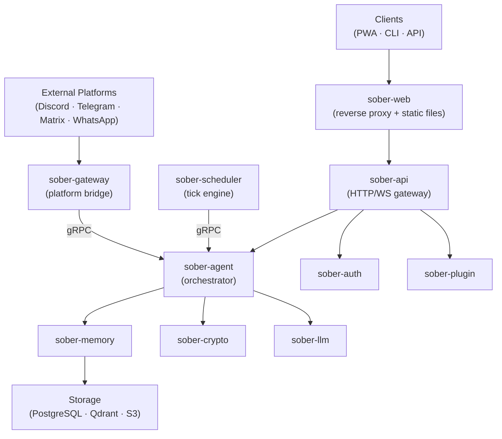

# Sõber

> *Your best, securest, and most scalable personal AI agent assistant.*

[](https://github.com/sober-io/sober/actions/workflows/ci.yml)
[](LICENSE)

---

## What is Sõber?

Sõber ("friend" in Estonian) is a self-evolving personal AI agent. It assists users with tasks, uses tools, manages scoped memory, and can discover and install plugins autonomously — all through an audited pipeline. Security-first, context-isolated, and designed to run on infrastructure you control.

---

## Features

- **Extensible agent system** — tool use, scoped memory, plugin installation, and autonomous scheduling
- **WASM plugin system** (Extism) — sandboxed execution via wasmtime, capability-gated host functions (KV, HTTP, secrets, LLM, memory, scheduling, filesystem, metrics, and more)
- **Process-level sandboxing** (bwrap) with policy profiles and network filtering
- **Scoped memory** with Qdrant vector search — hybrid dense + sparse (BM25) retrieval, context isolation across user/group/session boundaries
- **17 built-in agent tools** — web search, sandboxed shell, memory recall/remember, artifacts, secrets, snapshots, scheduling, plugin generation, and more
- **Multi-provider LLM support** — OpenRouter, Ollama, OpenAI, and local agents via ACP (Agent Client Protocol)
- **Prompt injection defense** — input sanitization, canary tokens, output filtering, and context firewall
- **Cryptographic agent identity** — ed25519 signing and AES-256-GCM envelope encryption
- **Unified CLI** — `sober` for admin, config, migrations, and runtime control
- **SvelteKit PWA frontend** — real-time streaming UI with WebSocket delivery
- **Autonomous scheduling** — cron, interval, and persisted job queues
- **Self-evolution** — autonomous plugin/skill installation, trait evolution, and soul layer adaptation (all audited)
- **MCP server/client integration** — Model Context Protocol tools run sandboxed via sober-sandbox

---

## Quick Start

**Prerequisites:** Docker and Docker Compose.

```bash
git clone https://github.com/sober-io/sober.git
cd sober
cp .env.example .env        # Edit with your LLM API key (uses SOBER_* env vars)
docker compose up -d
# Open http://localhost:8088
```

Alternatively, use a TOML-based config file:

```bash
cp infra/config/config.toml.example config.toml   # Edit as needed
docker compose up -d
```

---

## Installation

### One-liner

```bash
curl -fsSL https://raw.githubusercontent.com/sober-io/sober/main/scripts/install.sh | sudo bash
```

### Docker

See the [Docker installation guide](https://sober-io.github.io/sober/installation/docker.html).

### From source

See the [build from source guide](https://sober-io.github.io/sober/installation/source.html).

---

## Development

**Prerequisites:** Node.js 24, Rust (latest stable), pnpm, Docker.

```bash
just setup    # Configure git hooks (run once after cloning)
just dev      # Start dev servers (backend + frontend)
just test     # Run unit tests
just check    # Lint + type check
just fmt      # Format all code
just build    # Build all targets
```

> Docker is required for integration tests, sqlx compile-time checks, and PostgreSQL/Qdrant.
> Unit tests do not require Docker.

---

## Architecture



See [ARCHITECTURE.md](ARCHITECTURE.md) for the full system design, crate map, security model, and prompt assembly pipeline.

---

## Documentation

Full documentation is available at [https://sober-io.github.io/sober/](https://sober-io.github.io/sober/).

---

## License

MIT — see [LICENSE](LICENSE).
