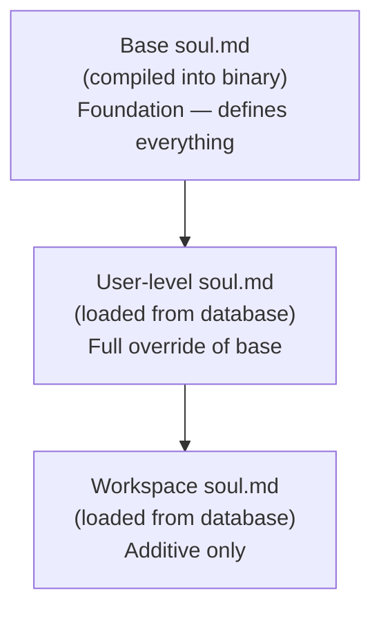

# Agent Mind

`sober-mind` owns everything related to the agent's identity, personality, and prompt construction. No other crate assembles system prompts. The agent delegates all prompt construction to `sober-mind`.

## Structured Instruction Directory

Base instructions live in `backend/crates/sober-mind/instructions/*.md`. Each file has YAML frontmatter declaring its category, visibility, and priority. They are compiled into the binary at build time via `include_str!()`, so there is zero runtime I/O for base instructions.

```yaml
---
category: personality
visibility: public
priority: 10
---
# The actual instruction content...
```

### Instruction Categories

Categories determine assembly order. Instructions are inserted into the system prompt in this sequence:

| Category | Assembly Order | Description |
|----------|---------------|-------------|
| `personality` | 1 | Identity, values, communication style (`soul.md`) |
| `guardrail` | 2 | Ethics, security rules, safety constraints (`safety.md`) |
| `behavior` | 3 | Memory usage, reasoning style, self-evolution rules |
| `operation` | 4 | Tool use, workspace operations, artifact handling, extraction |

### Visibility

Each instruction file declares one of two visibility levels:

| Visibility | Who sees it |
|------------|-------------|
| `public` | All triggers (human, replica, admin, scheduler) |
| `internal` | Admin and scheduler triggers only |

Internal instructions contain operational guidance that should not be visible in user-facing conversations (e.g., scheduler job context, admin commands).

## soul.md Resolution Chain

The agent's personality is defined by a layered `soul.md` resolution. Each layer can override or extend the one below it.



| Layer | Source | Override Rules |
|-------|--------|----------------|
| Base | `sober-mind/instructions/soul.md`, compiled into the binary | Foundation — defines identity, values, and communication style. |
| User | `~/.sober/soul.md` or database | Full override of base. The user controls their instance. |
| Workspace | `./.sober/soul.md` (project-level) | Additive only. Can adjust style and domain focus. Cannot contradict ethical boundaries or security guardrails. |

The resolved soul.md content is added to the system prompt during prompt assembly. The `SoulResolver` merges the three layers in order — base, then user override, then workspace additions.

## Dynamic Prompt Assembly

One engine in `sober-mind` composes the complete system prompt for each agent turn. The assembly sequence is:

1. **Resolved soul.md** — The merged output of the `SoulResolver` (base + user + workspace layers).
2. **Soul layers** — Per-user and per-group BCF `Soul` chunks, appended after the resolved soul.md. These represent autonomously evolved personality adaptations.
3. **Instruction files** — All instruction `.md` files filtered by visibility for the current trigger, sorted by category then priority.
4. **Task context** — What triggered this interaction (user message, scheduler job description, admin command context).
5. **Tool definitions** — The set of tools available for this turn, formatted for the model.

### Visibility Filtering by Trigger

The trigger type determines which instruction files are included:

| Trigger | `public` instructions | `internal` instructions |
|---------|-----------------------|------------------------|
| Human | Yes | No |
| Replica | Yes | No |
| Admin | Yes | Yes |
| Scheduler | Yes | Yes |

This ensures users never see operational instructions intended for autonomous or administrative operation.

## Trait Evolution

Personality evolves at two levels:

**Per-user/group soul layers** evolve freely and autonomously. The agent can add and modify `Soul` chunks in BCF containers based on observed patterns in conversations. These are stored in Qdrant and loaded as part of context. All changes are audit-logged.

**Base soul.md** requires either:
- High confidence: a consistent pattern observed across many contexts over time, OR
- Explicit admin approval.

Proposed base soul.md changes are queued as diff proposals with supporting reasoning before being applied.

## Self-Modification Scope

The agent's self-modification capabilities are bounded by the nature of the target:

| Target | Autonomy Level |
|--------|----------------|
| Memory / soul layers | Free — fully autonomous |
| Plugins / skills | Autonomous, subject to sandbox testing + audit pipeline |
| Base soul.md | High-confidence auto-adopt OR explicit admin approval |
| Core crate code | Propose only — generates a diff + reasoning + tests, queued for admin review |

This hierarchy ensures the system can improve itself continuously while keeping irreversible or security-sensitive changes under human oversight.

## Injection Detection

`sober-mind` owns the injection classifier that runs on all user input before it reaches the agent. See [Security — Prompt Injection Defense](./security.md#prompt-injection-defense) for the full five-layer model.
