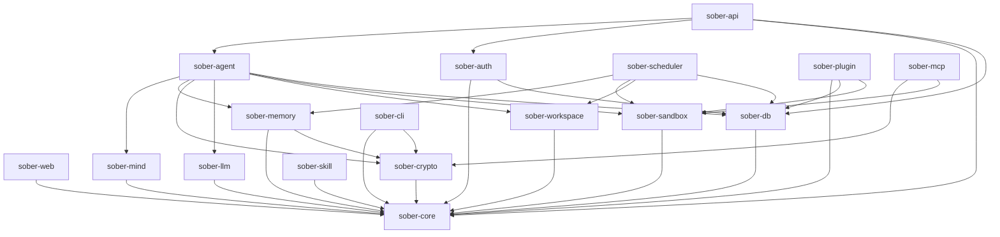

# Crate Map

The backend is a Cargo workspace of focused library and binary crates. Dependencies flow strictly downward: higher-level crates depend on lower-level ones, never the reverse. `sober-api` is never a dependency of any other crate.

## Full Crate Reference

| Crate | Responsibility |
|-------|---------------|
| `sober-core` | Shared types, error handling, config, domain primitives |
| `sober-db` | PostgreSQL access layer: pool creation, row types, `Pg*Repo` implementations |
| `sober-auth` | Authentication (password/Argon2id), RBAC/ABAC |
| `sober-memory` | Vector storage, memory pruning, scoped retrieval |
| `sober-agent` | **Binary.** Agent orchestration (gRPC server), replica lifecycle, task delegation, self-evolution |
| `sober-plugin` | Plugin registry, WASM host functions (11 capabilities via Extism), audit pipeline, blob-backed storage |
| `sober-plugin-gen` | WASM plugin code generation for predictable plugin logic |
| `sober-crypto` | Keypair management, envelope encryption, signing |
| `sober-api` | **Binary.** HTTP/WebSocket gateway, rate limiting, channel adapters, Unix admin socket |
| `sober-web` | **Binary.** Reverse proxy + embedded SvelteKit frontend |
| `sober-cli` | Unified CLI: config, user management, migrations (offline), scheduler control (runtime via UDS) |
| `sober-mind` | Agent identity, structured instructions + soul.md layering, prompt assembly, visibility filtering, trait evolution, injection detection |
| `sober-scheduler` | **Binary.** Autonomous tick engine, interval + cron scheduling, job persistence, local job execution via executor registry |
| `sober-mcp` | MCP server/client for tool interop; MCP servers run sandboxed via `sober-sandbox` |
| `sober-sandbox` | Process-level execution sandboxing (bwrap), policy profiles, network filtering, syscall audit |
| `sober-llm` | Multi-provider LLM abstraction: OpenAI-compatible HTTP and ACP (Agent Client Protocol) transports |
| `sober-workspace` | Workspace filesystem layout, git operations (git2), blob storage, config parsing |
| `sober-skill` | Skill registry and execution |

## Dependency Graph

## Key Design Rules

- **`sober-api` is never a dependency** of any other crate. External callers go through HTTP/WS.
- **`sober-scheduler` and `sober-agent` communicate via gRPC only** — no crate dependency between them.
- **`sober-cli` depends on `sober-core` and `sober-crypto`** — not on `sober-api`.
- Binary crates (`sober-agent`, `sober-api`, `sober-web`, `sober-scheduler`) are the only entry points. All business logic lives in library crates.

## Binary Crates

Five crates produce runnable binaries:

- **`sober-web`** — `sober-web` process
- **`sober-api`** — `sober-api` process
- **`sober-scheduler`** — `sober-scheduler` process
- **`sober-agent`** — `sober-agent` process
- **`sober-cli`** — `sober` unified CLI binary
