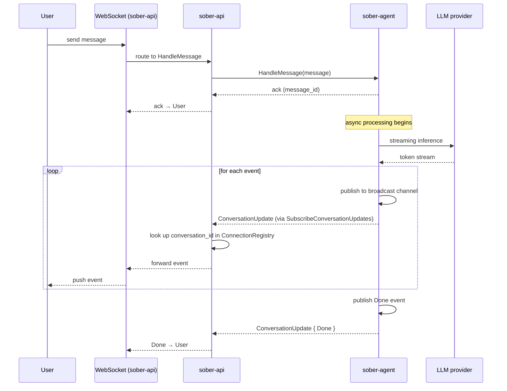
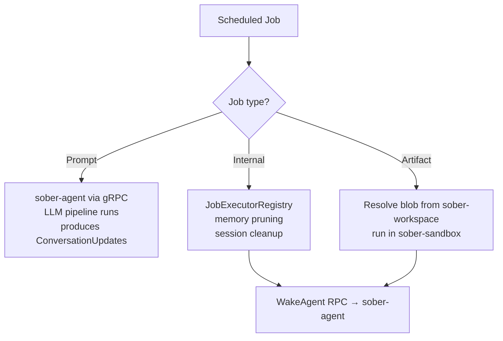

# Event Delivery

Conversation events flow through a subscription model that decouples event production from the caller. Any trigger — a user message, a scheduler job, an admin command — produces events that reach the frontend without the trigger needing to relay them.

## Subscription Model

`sober-api` subscribes to `sober-agent`'s event stream once at startup via the `SubscribeConversationUpdates` server-streaming RPC. It receives all conversation events for all conversations and routes each event to the correct WebSocket connection(s) via a `ConnectionRegistry` keyed by `conversation_id`.

```
sober-api ──SubscribeConversationUpdates──▶ sober-agent
                                                │
           ◀──── stream of ConversationUpdate ──┘
```

## RPCs

### HandleMessage (unary)

Accepts a user message and returns an ack containing the stored message ID. The agent processes the message asynchronously after acknowledging receipt. The caller does not wait for the LLM response.

### SubscribeConversationUpdates (server-streaming)

Called once by `sober-api` on startup. Returns a long-lived stream of `ConversationUpdate` messages for all conversations. The API fans out each event to the WebSocket connection(s) registered for that `conversation_id`.

## Message Flow



## ConversationUpdate Event Types

`ConversationUpdate` carries a typed `oneof event` field. The frontend handles each type independently:

| Event | Description |
|-------|-------------|
| `NewMessage` | A complete new message was stored (human or assistant) |
| `TitleChanged` | The conversation title was updated |
| `TextDelta` | An incremental text chunk from the streaming LLM response |
| `ToolCallStart` | The agent is beginning a tool call (includes tool name and input) |
| `ToolCallResult` | A tool call completed (includes result or error) |
| `ThinkingDelta` | An incremental chunk from the model's extended thinking stream |
| `ConfirmRequest` | The agent is requesting user confirmation before proceeding |
| `Done` | The agent has finished processing the current turn |
| `Error` | An error occurred during processing |

## Scheduler Job Routing

The scheduler routes jobs by payload type, not by caller identity. All jobs ultimately produce events through the same `ConversationUpdate` stream.



### Job Types

| Payload Type | Execution | Post-Execution |
|-------------|-----------|----------------|
| `Prompt` | Dispatched to `sober-agent` via gRPC; runs the full LLM pipeline | — (agent handles own events) |
| `Internal` | Executed locally via `JobExecutorRegistry` (e.g., memory pruning, session cleanup) | `WakeAgent` RPC notifies agent |
| `Artifact` | Blob resolved from `sober-workspace`, executed inside `sober-sandbox` | `WakeAgent` RPC notifies agent |

After local execution completes, the scheduler sends a `WakeAgent` RPC to `sober-agent`. The agent can then inspect the job result and produce any necessary `ConversationUpdate` events.

## ConnectionRegistry

The `ConnectionRegistry` in `sober-api` maps `conversation_id` values to open WebSocket connections. It handles:

- **Registration** — when a client opens a WebSocket and subscribes to a conversation.
- **Deregistration** — when a WebSocket disconnects (clean or unclean).
- **Fan-out** — a single event may be delivered to multiple connections (e.g., multiple browser tabs watching the same conversation).

Events for conversations with no registered connections are silently dropped (the client will catch up via the REST message history endpoint when it reconnects).
