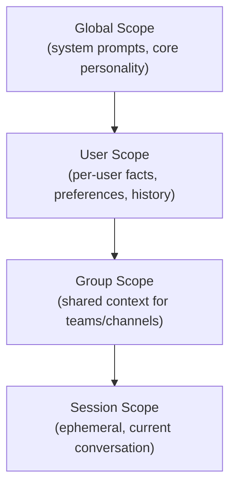

# Memory System

Sõber's memory system is built around two complementary stores: the **Binary Context Format (BCF)** for structured, scoped context containers, and **Qdrant** for vector-based semantic retrieval. Together they implement the principle of minimal context loading — only the data needed for the current operation is ever brought into the agent's working context.

## Binary Context Format (BCF)

BCF is a compact binary format for storing and loading agent context. It is designed for zero-copy reading and optional on-disk encryption.

### File Layout

```
┌─────────────────────────────┐
│  Header (28 bytes)          │
│  magic: "SÕBE" (6 bytes)    │
│  version: u8                │
│  flags: u8                  │
│  scope_id: UUID (16 bytes)  │
│  chunk_count: u32           │
├─────────────────────────────┤
│  Chunk Table                │
│  13 bytes per entry:        │
│    offset: u64              │
│    length: u32              │
│    type: u8                 │
├─────────────────────────────┤
│  Chunk Data                 │
│  zstd-compressed            │
│  optionally AES-256-GCM     │
│  encrypted per-chunk        │
├─────────────────────────────┤
│  HNSW Index Footer          │
│  (embedded vector index)    │
└─────────────────────────────┘
```

### Header Flags

The flags byte controls per-file behavior:

| Bit | Meaning |
|-----|---------|
| 0 | Chunks are compressed (zstd) |
| 1 | Chunks are encrypted (AES-256-GCM) |
| 2–7 | Reserved for future use |

### Chunk Types

Each chunk has a 1-byte type tag:

| Type | Value | Description |
|------|-------|-------------|
| `Fact` | 0 | Factual knowledge about the world or user |
| `Conversation` | 1 | Conversation history segments |
| `Skill` | 2 | Learned or installed skills |
| `Preference` | 3 | User preferences and behavioral adaptations |
| `Embedding` | 4 | Raw embedding vectors |
| `Code` | 5 | Versioned code artifacts |
| `Soul` | 6 | Personality layer adaptations |

### Reader and Writer

The BCF reader is zero-copy: it maps the chunk table and seeks directly to requested chunk offsets without deserializing the entire file. The writer appends chunks sequentially and builds the chunk table in memory before flushing the complete file.

## Memory Scoping

Each scope is a separate BCF container. Context loading follows the principle of least privilege: only the minimal required scopes are loaded for any operation.



| Scope | Contents | Persistence |
|-------|----------|-------------|
| Global | System prompts, base personality, shared knowledge | Permanent |
| User | Per-user facts, preferences, conversation history | Permanent |
| Group | Team/channel shared context | Permanent while group exists |
| Session | Ephemeral working context for the current conversation | Discarded after session ends |

A session loads its own scope plus all ancestor scopes, filtered to what is relevant for the current task.

## Context Loading Pipeline

Context is loaded in priority order before each agent turn:

1. **Global scope** — always loaded; contains base instructions and personality.
2. **User scope** — loaded for all user-triggered interactions.
3. **Group scope** — loaded when the interaction occurs in a group channel.
4. **Session scope** — loaded from the current conversation's ephemeral container.
5. **Passive loading** — `Preference` chunks are always included regardless of query relevance, since they affect all responses.
6. **Active recall** — a semantic query against Qdrant retrieves the top-k most relevant `Fact`, `Conversation`, and `Skill` chunks from the appropriate scoped collections.

The final context window is assembled from these layers, respecting the token budget.

## Qdrant Vector Storage

All knowledge chunks are embedded and indexed in Qdrant for semantic retrieval.

### Scoped Collections

Collections are scoped to avoid cross-context leakage:

| Collection | Contents |
|------------|----------|
| `system` | Global knowledge, base personality |
| `user_{id}` | Per-user facts, preferences, history |
| `group_{id}` | Group-shared knowledge |

### Hybrid Search

Retrieval combines two strategies:

- **Dense vector search** — cosine similarity over embedding vectors for semantic matching.
- **Sparse BM25 search** — keyword-based matching for precise term recall.

Results are fused with Reciprocal Rank Fusion (RRF) to produce a single ranked list.

### Importance Scoring

Each chunk carries an importance score that decays over time:

```
importance(t) = base_score * decay_factor ^ (days_since_access)
```

Frequently accessed chunks maintain high scores. Chunks that fall below the pruning threshold are candidates for eviction.

## Pruning and Decay

The scheduler runs a periodic `MemoryPruning` internal job that:

1. Queries all chunks with importance scores below the configured threshold.
2. Checks recency: chunks accessed within the protection window are exempt.
3. Removes qualifying chunks from both Qdrant and the BCF container.
4. Rebuilds the HNSW index footer after significant deletions.

Pruning thresholds are configurable per scope. Session-scope chunks are always discarded when the session ends, regardless of importance score.
