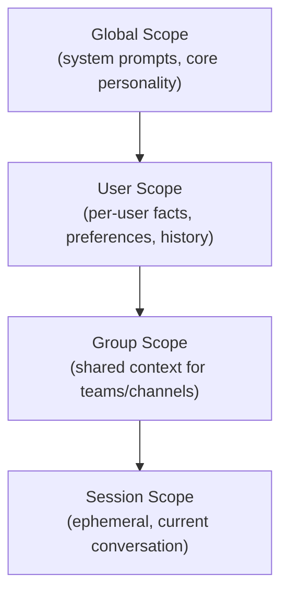

# Memory System

Sõber's memory system is built on **Qdrant** for vector-based semantic retrieval, implementing the principle of minimal context loading — only the data needed for the current operation is ever brought into the agent's working context.

## Chunk Types

Memories are categorised by type:

| Type | Value | Description |
|------|-------|-------------|
| `Fact` | 0 | Factual knowledge about the world or user |
| `Preference` | 1 | User preferences and behavioral adaptations |
| `Decision` | 2 | Decisions or choices made, with rationale |
| `Soul` | 3 | Personality layer adaptations |

## Memory Scoping

Each memory chunk carries a scope UUID in its Qdrant payload. Context loading follows the principle of least privilege: only the minimal required scopes are loaded for any operation.



| Scope | Contents | Persistence |
|-------|----------|-------------|
| Global | System prompts, base personality, shared knowledge | Permanent |
| User | Per-user facts, preferences, conversation history | Permanent |
| Group | Team/channel shared context | Permanent while group exists |
| Session | Ephemeral working context for the current conversation | Discarded after session ends |

A session loads its own scope plus all ancestor scopes, filtered to what is relevant for the current task.

## Context Loading Pipeline

Context is loaded in priority order before each agent turn:

1. **Global scope** — always loaded; contains base instructions and personality.
2. **User scope** — loaded for all user-triggered interactions.
3. **Group scope** — loaded when the interaction occurs in a group channel.
4. **Session scope** — loaded from the current conversation's ephemeral context.
5. **Passive loading** — `Preference` chunks are always included regardless of query relevance, since they affect all responses.
6. **Active recall** — a semantic query against Qdrant retrieves the top-k most relevant `Fact` and `Soul` chunks from the appropriate scoped collections.

The final context window is assembled from these layers, respecting the token budget.

## Qdrant Vector Storage

All knowledge chunks are embedded and indexed in Qdrant for semantic retrieval.

### Scoped Collections

Collections are scoped to avoid cross-context leakage:

| Collection | Contents |
|------------|----------|
| `system` | Global knowledge, base personality |
| `user_{id}` | Per-user facts, preferences, history |
| `group_{id}` | Group-shared knowledge |

### Hybrid Search

Retrieval combines two strategies:

- **Dense vector search** — cosine similarity over embedding vectors for semantic matching.
- **Sparse BM25 search** — keyword-based matching for precise term recall.

Results are fused with Reciprocal Rank Fusion (RRF) to produce a single ranked list.

### Importance Scoring

Each chunk carries an importance score that decays over time:

```
importance(t) = base_score * decay_factor ^ (days_since_access)
```

Frequently accessed chunks maintain high scores. Chunks that fall below the pruning threshold are candidates for eviction.

## Pruning and Decay

The scheduler runs a periodic `MemoryPruning` internal job that:

1. Queries all chunks with importance scores below the configured threshold.
2. Checks recency: chunks accessed within the protection window are exempt.
3. Removes qualifying chunks from Qdrant.

Pruning thresholds are configurable per scope. Session-scope chunks are always discarded when the session ends, regardless of importance score.
