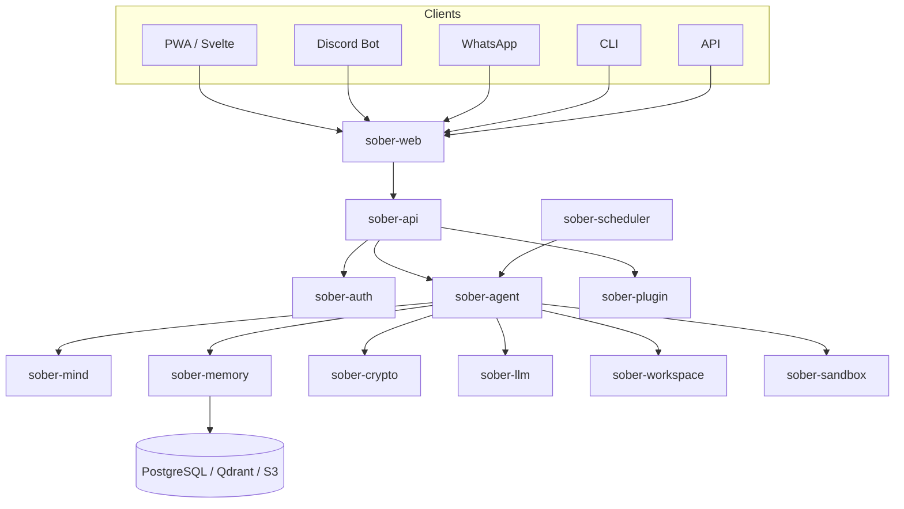

# Architecture Overview

Sõber is a self-evolving AI agent system built around three design pillars: security-first boundaries (zero trust, encrypted inter-process communication), strict context isolation (scoped BCF memory containers, no cross-user leakage), and plugin extensibility (audited WASM plugin pipeline for autonomous capability growth).

## Core Principles

1. **Security First** — Zero trust. Every boundary is authenticated and encrypted.
2. **Context Isolation** — User, group, and system contexts never leak across boundaries.
3. **Minimal Context Loading** — Load only what's needed; aggressively offload to external memory.
4. **Self-Evolution** — The system improves itself through audited plugin/skill installation.
5. **Source of Truth** — Executable code is always stored as versioned source; binaries are ephemeral.

## System Diagram

## Four Independent Processes

Sõber runs as four independent processes. Each can be started, stopped, and scaled independently.

| Process | Role | Socket / Port |
|---------|------|---------------|
| `sober-web` | Reverse proxy + static frontend | `:8080` (HTTP) |
| `sober-api` | HTTP/WS gateway, user-driven entry point | `/run/sober/api-admin.sock` |
| `sober-scheduler` | Autonomous tick engine, time-driven entry point | `/run/sober/scheduler.sock` |
| `sober-agent` | gRPC server, invoked by both API and scheduler | `/run/sober/agent.sock` |

### sober-web

The outermost layer. Serves the SvelteKit frontend (embedded via `rust-embed` or from disk), provides SPA fallback routing, and reverse-proxies all `/api/*` and WebSocket traffic to `sober-api`. Clients never communicate with `sober-api` directly.

### sober-api

The HTTP/WebSocket gateway. Enforces rate limiting and authentication middleware, routes incoming messages to `sober-agent` via gRPC, and maintains a `ConnectionRegistry` that maps conversation IDs to open WebSocket connections. It subscribes to `sober-agent`'s event stream on startup and fans out incoming events to the correct WebSocket clients.

### sober-scheduler

The time-driven entry point. Runs an autonomous tick engine for interval and cron-based jobs without requiring a user request. Routes jobs by payload type: prompt jobs go to `sober-agent` via gRPC, while internal and artifact jobs are executed locally. After local execution, notifies `sober-agent` via `WakeAgent` RPC.

### sober-agent

The gRPC server at the heart of the system. Handles agent orchestration and task delegation. Called by both `sober-api` (user-driven) and `sober-scheduler` (time-driven). Publishes all conversation events to an internal broadcast channel that `sober-api` subscribes to.

## Communication Boundaries

All inter-process communication uses gRPC over Unix Domain Sockets (UDS). Proto definitions live in `backend/proto/`. No crate directly depends on `sober-api` — external callers always go through the HTTP/WS gateway.

## Deployment

Docker Compose for local development, Kubernetes for production. See [Deployment](../deployment/index.md) for details.
