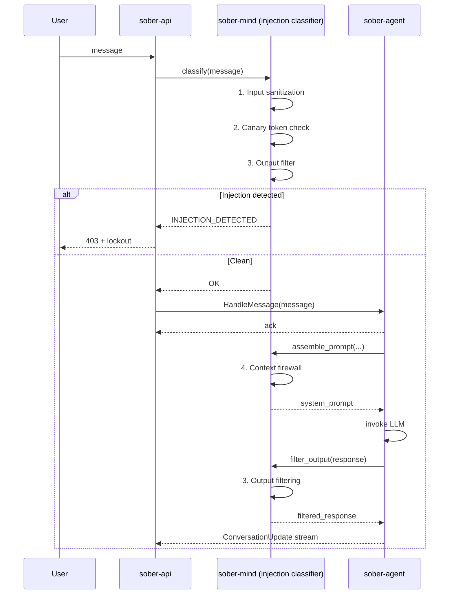

# Security

Security is a first-class concern throughout Sõber's design. The model is zero trust: every boundary is authenticated and encrypted, context never leaks across scopes, and all plugin/agent execution is sandboxed.

## Prompt Injection Defense

Sõber's injection defense is a five-layer pipeline owned by `sober-mind`. It runs on every user-submitted message before it reaches the agent.



### The Five Layers

1. **Input Sanitization** — All user input is passed through an injection classifier before being stored or forwarded to the agent. The classifier detects common prompt injection patterns, role-play escape attempts, and instruction override attempts.

2. **Canary Tokens** — Hidden markers are embedded in system prompts at assembly time. If a response contains a canary token, it indicates the system context was leaked to the model output, triggering an alert.

3. **Output Filtering** — Every LLM response is scanned for leaked system context before being forwarded to the client. Detected leakage triggers the same lockout flow as detected injection.

4. **Lockout** — A detected injection attempt triggers actor lockout (rate limit + temporary ban) and an admin alert. The lockout is scoped: a user locked out from one conversation does not affect others.

5. **Context Firewall** — System and private context (instructions, soul layers, internal tool results) are stored in separate memory regions and never concatenated raw with user input. The prompt assembler maintains strict boundaries between context zones.

## Process Sandboxing (bwrap)

Artifact jobs and MCP servers run inside process-level sandboxes managed by `sober-sandbox`. The sandbox uses `bubblewrap` (bwrap) to isolate execution.

### Policy Profiles

Each execution context has an assigned policy profile:

| Profile | Filesystem | Network | Syscalls |
|---------|------------|---------|----------|
| `strict` | Read-only bind mount of workspace only | None | Minimal set |
| `network` | Read-only workspace | Outbound HTTP/HTTPS only | Standard |
| `full` | Read/write workspace | Unrestricted | Full (audit logged) |

No profile grants access outside the designated workspace directory. The sandbox's audit log records all syscalls for the `full` profile.

### Network Filtering

Network access inside the sandbox is filtered at the process level. The `network` profile only permits outbound TCP to ports 80 and 443. All other traffic is rejected. DNS resolution is permitted.

## WASM Plugin Sandboxing

Plugins are executed inside a WASM sandbox backed by `wasmtime` via the `Extism` framework. The sandbox enforces capability-gated access to host functions.

### Capability-Gated Host Functions

Plugins must declare all required capabilities in their `plugin.toml` manifest. The host wires only the declared capabilities:

| Capability | Host Function | Description |
|------------|---------------|-------------|
| `kv` | `kv_get` / `kv_set` | Plugin-scoped key-value store |
| `http` | `http_request` | Outbound HTTP (allowlist-filtered) |
| `secrets` | `secret_get` | Read plugin-owned secrets |
| `llm` | `llm_complete` | LLM inference via `sober-llm` |
| `memory` | `memory_store` / `memory_query` | Read/write user memory |
| `conversation` | `conversation_send` | Send a message to a conversation |
| `scheduling` | `schedule_job` | Schedule a future job |
| `filesystem` | `fs_read` / `fs_write` | Scoped workspace access |
| `metrics` | `metrics_record` | Record plugin metrics |
| `tool_calls` | `tool_call` | Invoke other registered tools |
| `log` | `log` | Write to the plugin log |

A plugin that attempts to call a host function it did not declare receives a capability error at runtime.

### Plugin Audit Pipeline

```
DISCOVER → AUDIT → SANDBOX_TEST → INSTALL → MONITOR → UPDATE/REMOVE
```

1. **Static Analysis** — AST scanning for dangerous patterns before execution.
2. **Capability Declaration** — All required permissions must be declared in `plugin.toml`.
3. **Sandbox Execution** — First run in the WASM sandbox under observation.
4. **Behavioral Analysis** — Syscalls, network access, and memory usage are monitored.
5. **Code Generation** — For predictable plugin logic, native Rust/WASM is generated so execution does not require the LLM.

Generated WASM binaries are stored content-addressed in the `BlobStore`.

## Authentication Stack

### Current

| Method | Details |
|--------|---------|
| Password | Argon2id hashing, configurable memory/iteration parameters |
| Sessions | Cookie-based (`HttpOnly`, `Secure`, `SameSite=Strict`), PostgreSQL-backed |
| RBAC | Role-based access control with scoped permissions (knowledge, tools, agent, admin) |

### Planned

The following authentication methods are **planned** but not yet implemented:

| Method | Status |
|--------|--------|
| OIDC | Planned |
| WebAuthn / Passkeys | Planned |
| FIDO2 hardware tokens | Planned |
| HMAC-signed API keys | Planned |

### Authorization: RBAC + ABAC Hybrid

Permissions are scoped. A user may hold `ReadKnowledge` for their own scope without holding it for another user's scope. Group admins can grant group-scoped permissions to group members.

Permission scopes: `knowledge`, `tools`, `agent`, `admin`.

## Context Isolation

Memory scopes are enforced at the container level. Each scope is a separate BCF file with its own scope UUID embedded in the header. The context loading pipeline never mixes chunks from different user scopes. A bug that incorrectly loads the wrong scope would produce a UUID mismatch error rather than silently leaking data.

See [Memory System](./memory-system.md) for the full scoping model.

## Cryptographic Agent Identity

Each agent instance has a keypair (ed25519) generated at provisioning time and managed by `sober-crypto`. The keypair is used to:

- Sign messages sent to replica agents, binding them to the parent.
- Verify that incoming replica commands originate from the expected parent.
- Encrypt secrets at rest using AES-256-GCM envelope encryption.

Keypairs are stored encrypted in the database. The encryption key is derived from a master secret that is never persisted in plaintext.

## MCP Server Sandboxing

MCP servers invoked by the agent run inside a `sober-sandbox` process sandbox with the `strict` profile. Credentials required by the MCP server are decrypted by `sober-crypto` and injected into the sandbox environment at startup. The sandbox is torn down after the MCP session ends and credentials are not written to disk.
