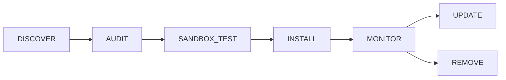

# Plugin Overview

Plugins extend Sõber with new tools and capabilities. They are distributed as
WebAssembly (WASM) modules, executed inside an Extism runtime backed by wasmtime.
The host exposes a fixed set of capability-gated functions that plugins call
across the WASM boundary using JSON-serialised messages.

## Plugin Kinds

| Kind | Description |
|------|-------------|
| **WASM** | Compiled WASM module with a `plugin.toml` manifest. Runs in the Extism sandbox. The primary plugin type covered in this section. |
| **Skill** | An executable or script registered by filesystem path. Invoked as a subprocess, not sandboxed by Extism. |
| **MCP** | An external process that speaks the Model Context Protocol. Sõber connects to it and proxies its tools. |

## Plugin Lifecycle

Every WASM plugin moves through a mandatory audit pipeline before it is
available for use.

| Stage | What happens |
|-------|-------------|
| **DISCOVER** | The agent or an admin submits WASM bytes and a manifest. |
| **AUDIT** | Four sequential checks run: `validate` → `sandbox` → `capability` → `test`. Any failure stops installation. |
| **SANDBOX_TEST** | The WASM module is loaded inside an Extism instance. The optional `__sober_test` export is called. |
| **INSTALL** | Plugin is written to the registry and its blob is stored content-addressed. |
| **MONITOR** | Runtime behaviour (syscalls, memory, network) is observed. |
| **UPDATE / REMOVE** | Plugins can be updated to a newer version or removed. |

## Audit Pipeline

The audit pipeline runs synchronously at install time and produces a typed
`AuditReport` with a verdict of `approved` or `rejected`.

**Stage 1 — validate**

Structural check: the manifest must parse cleanly, the `name` field must be
non-empty, at least one tool must be declared, and if the `metrics` capability
is enabled at least one metric must be declared.

**Stage 2 — sandbox**

The WASM bytes are loaded in an Extism instance with host functions wired from
the manifest. This confirms the module has no missing imports and is a valid
WASM binary.

**Stage 3 — capability**

The declared `[capabilities]` block is resolved into the flat capability list
that the sandbox enforcer uses at runtime. A structural failure here means a
manifest references unknown or malformed capability config.

**Stage 4 — test**

If the module exports a function named `__sober_test`, it is called with empty
input. A non-zero exit or any error rejects the plugin. Exporting this function
is optional but recommended as a self-test.

## Security Model

**WASM isolation.** Plugins run inside wasmtime via Extism. They cannot access
host memory, filesystem, or network directly. Every external operation must go
through a declared host function.

**Capability gating.** Each host function (except `host_log`) requires the
plugin to have declared the corresponding capability in its manifest. At load
time the declared capabilities are resolved into a flat list; at runtime each
call checks that list before executing. A missing capability returns a
`capability_denied` error to the plugin.

**Domain restriction.** The `network` capability can be narrowed to a list of
allowed hostnames. Requests to any other host are rejected before the HTTP call
is made.

**Path restriction.** The `filesystem` capability accepts an `allowed_paths`
list. Reads and writes outside those prefixes are denied.

**Audit log.** Every audit run is timestamped and stored. The full stage
results, verdict, and origin are available to admins.

## Plugin vs Skill vs Tool

| Concept | Where it lives | Execution |
|---------|---------------|-----------|
| **Plugin** | Registry, compiled WASM or external process | Extism sandbox / subprocess |
| **Skill** | Filesystem path | Subprocess |
| **Tool** | Defined by a plugin's manifest or by core | Called by the agent during a turn |

A plugin *exposes* tools. The agent calls tools; it does not call plugins directly.
