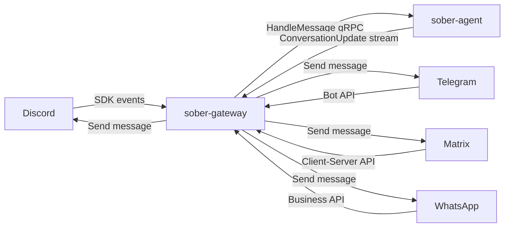

# Messaging Gateway

Sõber includes a messaging gateway (`sober-gateway`) that bridges external platforms — Discord, Telegram, Matrix, WhatsApp, and others — into Sõber conversations. Messages sent on those platforms are routed to the agent, and agent replies are delivered back to the platform in real time.

---

## Overview

The gateway is a separate process that connects to external platform APIs and communicates with `sober-agent` via gRPC over Unix domain sockets. Each inbound platform message is translated into a `HandleMessage` call on the agent; agent responses are delivered back via the platform's native send API.



The gateway subscribes to `SubscribeConversationUpdates` on the agent, just like `sober-api` does. This means all conversation events (text deltas, tool results, errors) flow back to the platform as they are produced.

---

## Supported Platforms

| Platform | Status | Notes |
|----------|--------|-------|
| Discord | Available | Bot token via Discord Developer Portal |
| Telegram | Planned | Bot API token |
| Matrix | Planned | Homeserver + access token |
| WhatsApp | Planned | WhatsApp Business Cloud API |

---

## Setup: Adding a Platform Connection

Platform connections are managed from **Settings → Messaging Gateway** in the web UI. Each connection requires:

1. A platform type (e.g., Discord).
2. A bot token or API credential for that platform.
3. An optional display name for the connection.

Once saved, the gateway authenticates with the platform and begins receiving events. The connection status (connected / disconnected / error) is shown in the settings page and in the Grafana dashboard.

To add a connection via environment variables at startup, see [Configuration](#configuration) below.

---

## Channel Mapping

A **channel mapping** links an external platform channel (e.g., a Discord text channel) to a Sõber conversation. Without a mapping, messages in that channel are ignored.

To create a channel mapping:

1. Go to **Settings → Messaging Gateway → Channel Mappings**.
2. Select the platform connection.
3. Enter the external channel ID (e.g., a Discord channel snowflake).
4. Select or create the Sõber conversation to route messages to.
5. Choose an [agent mode](#agent-mode).

Multiple channels can map to the same conversation. One channel maps to exactly one conversation.

---

## User Mapping

A **user mapping** links an external platform user (identified by their platform user ID) to a Sõber account. Mapped users' messages are attributed to their Sõber identity in the conversation.

To link a platform user to a Sõber account:

1. Go to **Settings → Messaging Gateway → User Mappings**.
2. Select the platform connection.
3. Enter the external user ID.
4. Select the Sõber account to link it to.

---

## Unmapped Users

When a message arrives from a platform user who has no user mapping, the gateway forwards it as a **bridge message** prefixed with their platform username:

```
[alice] Hey, can you summarise today's standup?
```

This allows the agent to see who sent the message even without a formal account link. The prefix format is `[username]` where `username` is the display name or handle on the platform.

---

## Agent Mode

Each channel mapping has an **agent mode** that controls when the agent responds:

| Mode | Behaviour |
|------|-----------|
| `always` | The agent responds to every message in the channel. |
| `mention` | The agent responds only when the bot is mentioned (e.g., `@Sober`). |
| `silent` | Messages are routed and stored but the agent does not reply. |

`mention` mode is recommended for shared channels to avoid the agent responding to every message. `always` is suited for dedicated 1:1 or bot-only channels.

---

## Configuration

The gateway is configured via environment variables. All variables are prefixed with `SOBER_GATEWAY_`.

| Variable | Default | Description |
|----------|---------|-------------|
| `SOBER_GATEWAY_AGENT_SOCKET` | `/run/sober/agent.sock` | UDS path to `sober-agent` gRPC socket. |
| `SOBER_GATEWAY_LISTEN_ADDR` | `/run/sober/gateway.sock` | UDS path for the gateway's own gRPC socket. |
| `SOBER_GATEWAY_DISCORD_TOKEN` | — | Discord bot token. Enables Discord on startup if set. |
| `SOBER_GATEWAY_TELEGRAM_TOKEN` | — | Telegram bot token. Enables Telegram on startup if set. |
| `SOBER_GATEWAY_RECONNECT_DELAY_SECS` | `5` | Seconds between reconnect attempts on platform disconnect. |
| `SOBER_GATEWAY_MAX_RECONNECT_ATTEMPTS` | `10` | Maximum reconnect attempts before marking a connection as failed. |
| `SOBER_GATEWAY_MESSAGE_TIMEOUT_SECS` | `30` | Timeout for agent `HandleMessage` gRPC calls. |

Credentials set via environment variables create a read-only platform connection at startup. To manage connections dynamically (add, update, remove tokens at runtime), use the web UI or CLI.

```bash
# CLI: list gateway connections
sober gateway list

# CLI: view channel mappings for a connection
sober gateway channels <connection-id>

# CLI: reload gateway config from database
sober gateway reload
```
