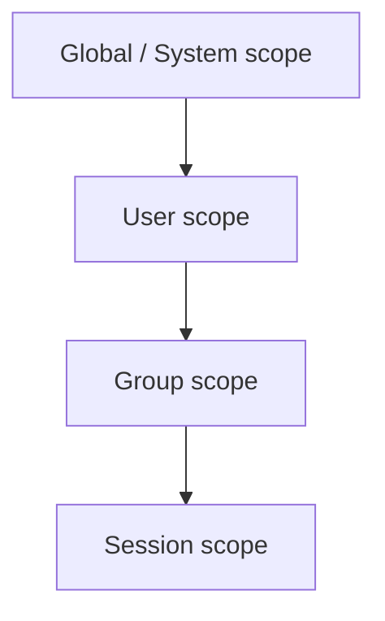

# Memory

Sõber maintains persistent memory across conversations. Rather than relying on a fixed context window, it stores knowledge in a structured binary format and retrieves relevant memories on demand using vector search.

---

## What the Agent Remembers

The agent accumulates several kinds of memories over time:

| Kind | Examples |
|------|---------|
| `fact` | "Alice works at Acme Corp", "the project uses PostgreSQL 17" |
| `preference` | "User prefers dark mode", "always use British English" |
| `skill` | "How to set up a Rust workspace", "steps to deploy via Docker Compose" |
| `code` | Frequently referenced code snippets, custom functions |
| `conversation` | Summaries of past conversations |
| `soul` | Per-user personality layer adaptations |

Memories are stored when:
- The user explicitly says "remember this" or similar.
- The agent detects an important fact or preference during a conversation and calls `remember`.
- A conversation summary is extracted at end-of-session.

---

## Memory Scopes

Memory is partitioned into scopes that enforce isolation. Context loading follows the principle of least privilege — only the minimal required scopes are loaded for any operation.



| Scope | Qdrant Collection | Description |
|-------|-------------------|-------------|
| **System** | `system` | System prompts, base personality, shared knowledge. |
| **User** | `user_{uuid}` | Per-user facts, preferences, conversation history. Isolated per user. |
| **Group** | `user_{uuid}` (shared logically) | Group conversations support multiple users with roles and agent modes. Memories from group conversations are currently stored in the individual user's scope — shared group memory collections are planned. |
| **Session** | (ephemeral) | Current conversation context. Not persisted to Qdrant — loaded from recent messages in the database. |

The four-level scope hierarchy is defined in the type system (`ScopeKind` enum). Currently, Qdrant collections exist at the **system** and **user** levels. Group and session scoping use logical filtering within those collections rather than dedicated collections.

---

## Binary Context Format (BCF)

Memories at rest are stored in BCF, a compact binary format optimised for fast loading and streaming to the LLM context. Each BCF container holds all memories for one scope.

### Header (28 bytes)

| Offset | Size | Field | Description |
|--------|------|-------|-------------|
| 0 | 4 | magic | `SÕBE` — bytes `0x53 0xD5 0x42 0x45` |
| 4 | 2 | version | Format version (`1` for current). |
| 6 | 2 | flags | Feature flags: bit 0 = encrypted, bit 1 = compressed (reserved for future use). |
| 8 | 16 | scope_id | UUID of the scope this container belongs to. |
| 24 | 4 | chunk_count | Number of chunks in this container. |

### Chunk Table

Immediately follows the header. Each entry is 13 bytes:

| Offset | Size | Field | Description |
|--------|------|-------|-------------|
| 0 | 8 | offset | Byte offset of the chunk data from the start of the data section. |
| 8 | 4 | length | Byte length of the chunk data. |
| 12 | 1 | chunk_type | Chunk type discriminant (see below). |

### Chunk Types

| Discriminant | Name | Description |
|-------------|------|-------------|
| 0 | `Fact` | Extracted knowledge fact. |
| 1 | `Conversation` | Conversation summary or key exchange. |
| 2 | `Embedding` | Raw f32 embedding vector (not directly returned in recall results). |
| 3 | `Preference` | User preference or personal setting. |
| 4 | `Skill` | Learned skill or capability description. |
| 5 | `Code` | Code snippet or technical reference. |
| 6 | `Soul` | Soul layer data — per-user personality adaptations. |

### Data Section

Chunk payloads follow the chunk table. Chunks may be individually compressed (zstd) or encrypted (AES-256-GCM) in future versions — the `flags` field in the header indicates which features are active. Currently the flags field is reserved and always zero.

---

## Vector Retrieval via Qdrant

Every chunk stored via `remember` is embedded into a dense vector using the configured embedding model and upserted into Qdrant. This enables semantic similarity search: the agent can find relevant memories even when the exact words do not match.

### Hybrid Search

Recall queries combine two signals:

- **Dense vector search** — the query is embedded and compared against stored vectors using cosine similarity.
- **Sparse BM25 keyword search** — traditional term-frequency matching for exact keyword recall.

The combined score ranks results for the agent.

> **Roadmap:** Plan 031 will introduce PostgreSQL `tsvector`-based full-text search as a fallback and complement to Qdrant vector search — useful for exact-match keyword queries and when the vector store is unavailable.

### Scoped Collections

Qdrant collections are scoped per-user to enforce isolation. A user's recall query searches only `user_{uuid}` (and optionally `system`). No cross-user data leaks are possible at the collection level.

---

## Memory Decay and Pruning

Memories are not permanent by default. Each chunk carries an importance score that decays over time using exponential half-life decay:

```
decayed_importance = base_importance × 0.5^(elapsed_days / half_life_days)
```

Default `half_life_days`: 30 (configurable in `[memory]` section of `config.toml`).

When a memory is retrieved via `recall`, its importance score is **boosted** by the configured `retrieval_boost` (default: 0.2), capped at 1.0. This keeps frequently-accessed memories alive.

A background pruning job (`MemoryPruning` internal operation) periodically removes chunks whose decayed importance falls below `prune_threshold` (default: 0.1). You can tune these values in your configuration:

```toml
[memory]
decay_half_life_days = 30   # How quickly memories fade
retrieval_boost = 0.2       # Importance boost on each access
prune_threshold = 0.1       # Score below which memories are deleted
```

---

## Context Loading Priority

When a new conversation turn starts, the agent loads context in this priority order:

1. **Recent messages** — always loaded first, truncated to a configurable count. These are the highest priority because they represent the active dialogue.
2. **User-scope memories** — passive loading fetches only `preference` chunks. This shapes the agent's tone and style without consuming the full context budget with facts and code snippets.
3. **System-scope memories** — global knowledge chunks, if requested.

Facts, skills, code snippets, and conversation history are **not** loaded passively. The agent uses `recall` to fetch them on demand when they are relevant to the current query. This keeps the context window lean and avoids irrelevant information.

---

## Controlling Memory

### Explicit storage

Ask the agent to remember something:

> "Remember that I prefer snake_case for variable names in Python."

The agent calls `remember` with `chunk_type: "preference"` and an appropriate importance score.

### Importance scoring

You can guide importance when asking the agent to remember something:

> "This is really important — remember that the API key expires on March 31."

The agent interprets urgency cues and assigns a higher importance score (closer to 1.0).

### Forgetting

Ask the agent to forget something:

> "Forget that I told you my email address."

The agent searches for the relevant memory and, if found, deletes it from Qdrant.

### Reviewing memories

Ask the agent what it knows about a topic:

> "What do you remember about my coding preferences?"

The agent calls `recall` and presents the results.
