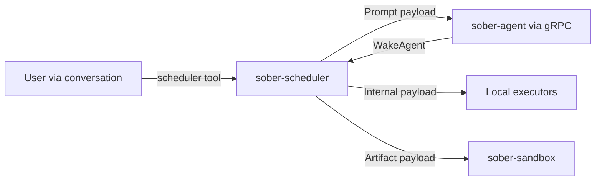

# Scheduling

Sõber includes an autonomous scheduler (`sober-scheduler`) that runs jobs independently of active user conversations. You can use it to automate recurring tasks — sending prompts to the agent on a schedule, running maintenance operations, or executing workspace scripts.

---

## Overview

The scheduler is a separate process that communicates with the agent and API via gRPC over Unix domain sockets. It runs a tick engine that wakes up on a configurable interval (default: every second), finds due jobs in the database, and dispatches them.



After a locally-executed job completes, the scheduler notifies the agent via `WakeAgent` gRPC so the agent can post-process results and deliver them to the relevant conversation.

---

## Job Types

Each job has a **payload type** that determines how it is dispatched:

### Prompt jobs

A prompt is sent through the full LLM pipeline in `sober-agent`. The agent processes the prompt, calls tools as needed, and delivers the response to the conversation specified at job creation time.

Use this for:
- Daily summaries ("Summarise my tasks for today")
- Scheduled research ("Every Monday morning: check news relevant to my project")
- Automated reports

```
payload_type: prompt
text: "Summarise any new GitHub issues in my projects and post a report"
model_hint: "anthropic/claude-sonnet-4"  # optional
```

### Internal jobs

Built-in maintenance operations executed locally by the scheduler without involving the LLM:

| Operation | Description |
|-----------|-------------|
| `MemoryPruning` | Remove expired/low-importance memory chunks from Qdrant. |
| `SessionCleanup` | Clean up expired session records from the database. |
| `VectorIndexOptimize` | Optimise Qdrant vector indices. |
| `PluginAudit` | Re-audit installed plugins for security. |

These run on fixed system schedules (configured at startup) but can also be triggered manually via `soberctl` or scheduled via the `scheduler` tool.

### Artifact jobs

A blob artifact (WASM binary or shell script) stored in `BlobStore` is executed in the `sober-sandbox`. The result is persisted and the agent is notified via `WakeAgent`.

```
payload_type: artifact
blob_ref: "sha256:<hash>"
workspace_id: "<uuid>"
artifact_type: "Script"  # or "Wasm"
```

---

## Schedule Formats

Two formats are supported:

### Interval schedules

```
every: 30s      # every 30 seconds
every: 5m       # every 5 minutes
every: 1h       # every hour
every: 24h      # every 24 hours
```

The interval is calculated from the time the job last ran, not from a wall-clock anchor.

### Cron expressions

Standard 5-field cron syntax (second-level cron with 7 fields is also supported):

```
0 9 * * MON-FRI        # 9:00 AM on weekdays
0 */6 * * *            # every 6 hours
0 3 * * *              # 3:00 AM daily
0 0 1 * *              # midnight on the 1st of each month
30 17 * * FRI          # 5:30 PM every Friday
```

---

## Job Lifecycle

```
PENDING → ACTIVE → RUNNING → DONE
                          ↘ FAILED
         PAUSED ←→ ACTIVE
         CANCELLED
```

| Status | Description |
|--------|-------------|
| `active` | Scheduled, waiting for next run time. |
| `running` | Currently executing. |
| `paused` | Manually paused, will not run until resumed. |
| `cancelled` | Permanently stopped, will not run again. |

Each job execution creates a **run record** with status, start/finish times, result bytes, and any error message.

---

## Job Persistence and Recovery

All jobs and run history are stored in PostgreSQL. The scheduler re-loads all active jobs on startup, recalculates next-run times for any missed intervals (it does not re-execute missed jobs — it just schedules the next future run), and begins ticking.

If the scheduler crashes mid-execution, jobs in `running` state are reset to `active` on the next startup.

---

## Concurrency Limits

The scheduler processes up to `max_concurrent_jobs` (default: 10) jobs simultaneously. Jobs beyond this limit queue until a slot becomes available.

```toml
[scheduler]
tick_interval_secs = 1     # How often to check for due jobs
max_concurrent_jobs = 10   # Maximum parallel job executions
```

---

## Creating a Job via the Agent

Use the `scheduler` tool in a conversation:

**Create a daily report job:**

```
Ask Sõber: "Create a scheduled job that sends me a daily morning briefing at 9am."
```

Sõber will call the `scheduler` tool with:

```json
{
  "action": "create",
  "name": "daily-briefing",
  "schedule": "0 9 * * *",
  "payload_type": "prompt",
  "text": "Good morning! Please provide a brief summary of: 1) any pending tasks I have, 2) relevant news for my projects.",
  "conversation_id": "<current-conversation-uuid>"
}
```

**List your jobs:**

```
Ask Sõber: "What scheduled jobs do I have?"
```

**Pause a job:**

```
Ask Sõber: "Pause the daily briefing job."
```

---

## Managing Jobs via soberctl

For direct control without going through the agent:

```bash
# List all active jobs
soberctl scheduler list

# Get details on a specific job
soberctl scheduler get <job-id>

# Force a job to run immediately
soberctl scheduler run <job-id>

# Pause a job
# (use the agent's scheduler tool for pause/cancel — soberctl has cancel)
soberctl scheduler cancel <job-id>

# Pause the entire tick engine (maintenance mode)
soberctl scheduler pause
soberctl scheduler resume

# View run history for a job
soberctl scheduler runs <job-id> --limit 10
```

---

## System Jobs

The scheduler registers several system jobs at startup. These are owned by the `system` owner type and run on fixed schedules:

| Job | Schedule | Description |
|-----|---------|-------------|
| Memory pruning | Daily (3:00 AM) | Prune low-importance memory chunks. |
| Session cleanup | Daily (4:00 AM) | Remove expired session records. |
| Vector index optimization | Weekly (Sunday 2:00 AM) | Optimise Qdrant indices. |
| Plugin audit | Weekly (Saturday 3:00 AM) | Re-audit installed plugins. |

System jobs are visible to admin users in `soberctl scheduler list` but cannot be modified via the conversation interface.
