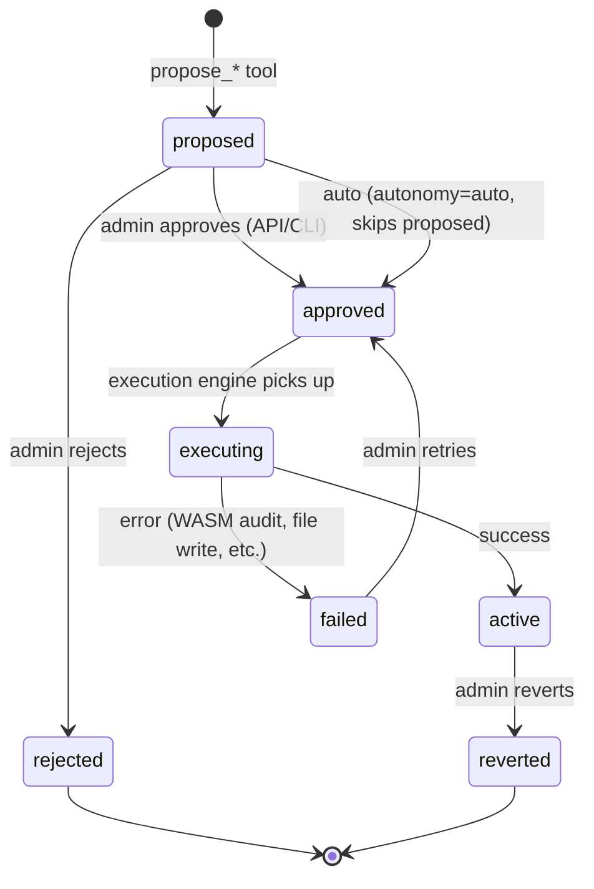
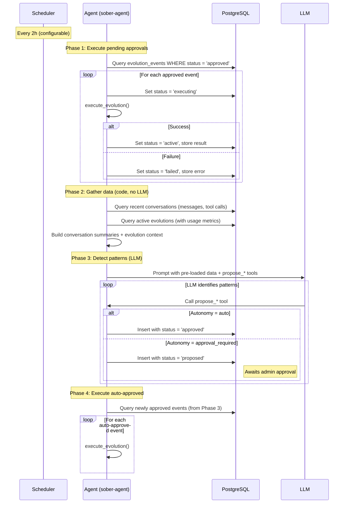
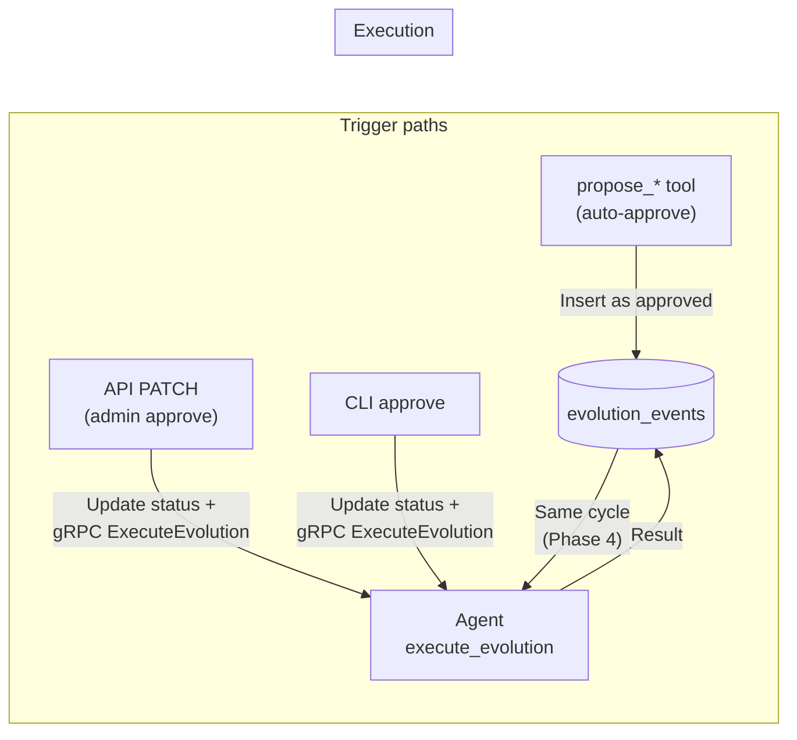
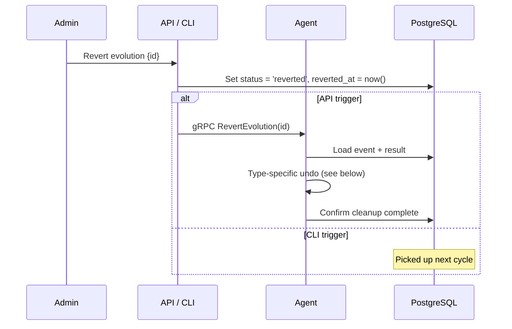
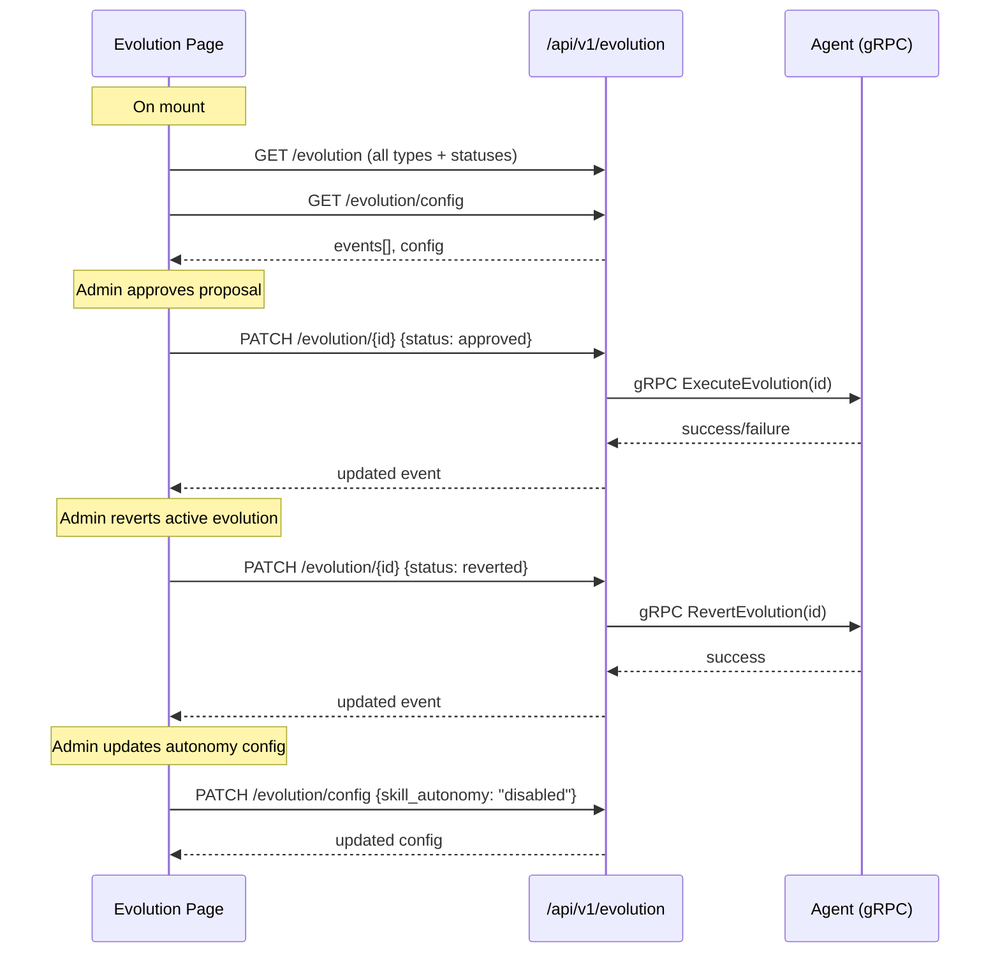

# #030: Self-Evolution Loop

## Overview

The agent periodically reviews conversations and autonomously evolves by
generating plugins, creating skills, improving its own instructions, and
scheduling automations. Everything is system-owned, auditable, configurable,
and revertible.

**Builds on:** `sober-mind` stubs (evolution.rs, layers.rs), the scheduled
`trait_evolution_check` system job, `sober-plugin-gen` (plugin generation),
`sober-skill` (skill catalog), `sober-plugin` (WASM hosting + audit pipeline),
and `sober-scheduler` (job management).

**Deferred:** Core code proposals (agent proposes diffs to its own crate code)
— separate future plan.

---

## Evolution Types

| Type | Tool | What it produces | Scope |
|------|------|-----------------|-------|
| Plugin (WASM) | `propose_tool` | WASM binary tool via `sober-plugin-gen` | System (all users) |
| Skill | `propose_skill` | Prompt-based skill (`PluginKind::Skill`) via `sober-skill` | System (all users) |
| Instruction | `propose_instruction_change` | Instruction overlay file in `~/.sober/instructions/` | System (all users) |
| Automation | `propose_automation` | Scheduled job via `sober-scheduler` | User-targeted |

All evolutions are **system-owned** and **user-attributed** — `user_id` tracks
whose interaction patterns triggered the detection, not ownership. Plugins,
skills, and instructions benefit all users. Automations target specific users.

---

## Detection Pipeline

### Trigger

The existing `trait_evolution_check` system job is renamed to
`self_evolution_check` with a **configurable interval** (default: every 2
hours, was daily at 3 AM). The scheduler fires a generic Prompt job to the
agent via gRPC — no evolution-specific data gathering happens in the scheduler.
The agent's handler for `self_evolution_check` does all data gathering and
prompt construction internally (Scheduler-triggered, so full access and
internal instruction sections are visible).

### Hybrid Detection — Code Gathers, LLM Analyzes

Detection is a **two-phase hybrid**: code gathers all data efficiently (no
token cost), then feeds it to the LLM for pattern recognition.

**Phase 1 — Data gathering (code, no LLM):**

Inside the agent, after receiving the generic Prompt job, the handler queries:
1. **Recent conversations** — `MessageRepo::list_by_conversation()` across all
   active conversations from the last interval. Summarized into a compact
   format (user ID, tool calls used, topics, message count).
2. **Active evolutions** — `EvolutionRepo::list_active()` with usage metrics.
3. **Approved evolutions** — `EvolutionRepo::list()` with status `approved`
   (for Phase 1 execution, see Execution Engine).

**Phase 2 — Pattern analysis (LLM):**

The gathered data is injected as context into a dynamically constructed prompt.
The LLM identifies patterns and calls `propose_*` tools. It does NOT use the
`recall` tool — all data is pre-loaded.

The prompt instructs the agent to:

1. Analyze the provided conversation summaries for recurring patterns.
2. Review active evolutions to avoid redundancy and identify obsolete ones.
3. For each detected pattern, call the appropriate `propose_*` tool.
4. Limit to **max 5 proposals per cycle**.

Injected context example:

```
Recent conversation activity (last 2h):
- User alice: 3 conversations, used web_search 8x, fetch_url 6x (pattern: URL fetching + summarization)
- User bob: 2 conversations, asked for ELI5 explanations 4x
- User charlie: 1 conversation, requested project status summary (also requested last Monday)

Active evolutions:
- [plugin] url-summarizer: Fetches and summarizes web pages (invoked 47 times, last used 2h ago)
- [skill] eli5-explainer: Explains technical concepts simply (invoked 12 times, last used 1d ago)
- [automation] monday-summary: Sends user X a project summary Mondays 9 AM
- [instruction] reasoning.md: Enhanced multi-step debugging approach (applied 2026-03-15)

Do not propose evolutions that duplicate existing capabilities.
Consider whether any active evolutions should be revised or removed.
```

### Pattern Examples

| Pattern detected | Evolution type | Example |
|-----------------|---------------|---------|
| User repeatedly fetches URLs and extracts data | Plugin | `url-data-extractor` WASM tool |
| Users frequently ask for ELI5 explanations | Skill | `eli5-explainer` prompt skill |
| Agent's debugging reasoning is consistently suboptimal | Instruction | Modified `reasoning.md` |
| User always requests a Monday morning status summary | Automation | Weekly scheduled job |

---

## Tool Parameter Schemas

Each `propose_*` tool has a focused JSON input schema. The `confidence` field
is an LLM-generated score (0.0–1.0) based on how consistent and frequent the
observed pattern is.

### `propose_tool`

```json
{
  "type": "object",
  "properties": {
    "name":         { "type": "string", "description": "Tool name (kebab-case)" },
    "description":  { "type": "string", "description": "What the tool does" },
    "capabilities": { "type": "object", "description": "Required capabilities (network, filesystem, etc.)" },
    "pseudocode":   { "type": "string", "description": "High-level logic for the generation pipeline" },
    "confidence":   { "type": "number", "minimum": 0, "maximum": 1 },
    "evidence":     { "type": "string", "description": "Summary of conversations that triggered this" },
    "source_count": { "type": "integer", "minimum": 1 },
    "user_id":      { "type": "string", "description": "UUID of user whose patterns triggered this (optional)" }
  },
  "required": ["name", "description", "pseudocode", "confidence", "evidence", "source_count"]
}
```

### `propose_skill`

```json
{
  "type": "object",
  "properties": {
    "name":            { "type": "string", "description": "Skill name (kebab-case)" },
    "description":     { "type": "string", "description": "What the skill does" },
    "prompt_template": { "type": "string", "description": "The prompt template content" },
    "confidence":      { "type": "number", "minimum": 0, "maximum": 1 },
    "evidence":        { "type": "string" },
    "source_count":    { "type": "integer", "minimum": 1 },
    "user_id":         { "type": "string" }
  },
  "required": ["name", "description", "prompt_template", "confidence", "evidence", "source_count"]
}
```

### `propose_instruction_change`

```json
{
  "type": "object",
  "properties": {
    "file":        { "type": "string", "description": "Instruction file path relative to instructions/ (e.g., behavior/reasoning.md)" },
    "new_content": { "type": "string", "description": "Full replacement content for the instruction file" },
    "rationale":   { "type": "string", "description": "Why this change improves agent behavior" },
    "confidence":  { "type": "number", "minimum": 0, "maximum": 1 },
    "evidence":    { "type": "string" },
    "source_count":{ "type": "integer", "minimum": 1 },
    "user_id":     { "type": "string" }
  },
  "required": ["file", "new_content", "rationale", "confidence", "evidence", "source_count"]
}
```

### `propose_automation`

```json
{
  "type": "object",
  "properties": {
    "job_name":        { "type": "string", "description": "Human-readable job name" },
    "schedule":        { "type": "string", "description": "Cron expression" },
    "prompt":          { "type": "string", "description": "Prompt text for the scheduled job" },
    "target_user_id":  { "type": "string", "description": "UUID of user this automation serves" },
    "conversation_id": { "type": "string", "description": "Conversation to deliver results to" },
    "confidence":      { "type": "number", "minimum": 0, "maximum": 1 },
    "evidence":        { "type": "string" },
    "source_count":    { "type": "integer", "minimum": 1 }
  },
  "required": ["job_name", "schedule", "prompt", "target_user_id", "confidence", "evidence", "source_count"]
}
```

---

## Approval & Execution

### Autonomy Configuration

```toml
[evolution]
interval = "2h"
```

The interval is loaded via env var `SOBER_EVOLUTION_INTERVAL`. Autonomy levels
are stored in the `evolution_config` DB table (see Configuration Extension)
and modifiable at runtime via `PATCH /api/v1/evolution/config`.

### Status Lifecycle



| Status | Meaning |
|--------|---------|
| `proposed` | Agent created the proposal, awaiting admin approval |
| `approved` | Approved (auto or manual), queued for execution |
| `executing` | Execution engine is processing (compiling WASM, writing files, etc.) |
| `active` | Evolution is live and in use |
| `failed` | Execution failed. Admin can retry by re-approving |
| `rejected` | Admin rejected the proposal |
| `reverted` | Previously active evolution was rolled back |

### Execution Engine



The `self_evolution_check` job runs on a configurable interval (default: 2h).
The scheduler dispatches it as a Prompt job to the agent via gRPC. The agent
runs four phases in sequence:

1. **Execute pending approvals** — drain any events in `approved` status.
   These come from admin approvals (API/CLI) between cycles or retries.
   Status transitions use atomic guards:
   `UPDATE SET status = 'executing' WHERE id = $1 AND status = 'approved'`.
   If 0 rows affected, the event was already picked up by another trigger
   (API or CLI approval running concurrently). Skip silently.
2. **Gather data** — query recent conversations and active evolutions
   directly via repos (no LLM, no token cost).
3. **Detect patterns** — LLM analyzes pre-loaded data, calls `propose_*`
   tools. Auto-approved proposals are inserted with `approved` status.
   Approval-required proposals are inserted with `proposed` status.
4. **Execute auto-approved** — drain any events auto-approved in Phase 3.
   Everything resolves within a single cycle.

The only events that wait between cycles are `proposed` events awaiting
admin approval.

All execution runs inside `sober-agent` — it already depends on
`sober-plugin-gen`, `sober-skill`, and `sober-mind`, so no new cross-crate
dependencies are needed.

### Execution Triggers

The agent also exposes a **`ExecuteEvolution`** gRPC RPC so the API can
trigger immediate execution when an admin approves via the web UI.



| Trigger | Mechanism | Execution timing |
|---------|-----------|-----------------|
| Auto-approve (tool) | Insert with `approved` status | Same cycle (Phase 4) |
| Admin approve (API) | Update DB + gRPC `ExecuteEvolution` | Immediate |
| Admin approve (CLI) | Update DB + gRPC `ExecuteEvolution` via agent UDS | Immediate |

**WASM tool execution:**
1. Extract payload (name, description, capabilities, pseudocode).
2. Dispatch to `sober-plugin-gen` — LLM generates code + manifest, compiles
   to WASM.
3. Run through `sober-plugin` audit pipeline (static analysis, sandbox test).
4. If audit passes → register as `PluginKind::Wasm` in `plugins` table, wrap
   as tool. Status → `active`. Store plugin ID in `result`.
5. If audit fails → status → `failed`. Store error in `result`. Admin can
   retry by re-approving.

**Skill execution:**
1. Extract payload (name, description, prompt template).
2. Write skill file with frontmatter to the skill directory.
3. Register as `PluginKind::Skill` in the `plugins` table (centrally tracked
   by plugin manager). Reload `SkillCatalog`.
4. Status → `active`. Store plugin ID and skill path in `result`.

**Instruction execution:**
1. Extract payload (target file, new content).
2. Validate target is not a guardrail/safety file (reject files with
   `category: guardrail` in frontmatter or on the hardcoded blocklist —
   enforced at tool level).
3. Read current file content from the overlay directory (or base instructions
   if no overlay exists). Store as `previous_content` in payload.
4. Write new content to `~/.sober/instructions/{file}` (overlay directory).
5. Status → `active`.

> **Instruction overlay mechanism:** Base instructions are compiled into the
> binary via `include_str!()` and cannot be modified at runtime. Instruction
> evolutions write **overlay files** to `~/.sober/instructions/` on disk. The
> prompt assembly engine in `sober-mind` checks the overlay directory first —
> if an overlay exists for an instruction file, it takes precedence over the
> compiled-in version. This mirrors the existing `soul.md` resolution chain
> (base → user → workspace layering).

After writing the overlay file, the execution engine calls
`Mind::reload_instructions()` to clear the in-memory cache. This ensures the
new instruction takes effect on the next prompt assembly without requiring an
agent restart.

**Automation execution:**
1. Extract payload (job name, schedule, prompt, target user, conversation).
2. Create scheduled job via `JobRepo::create()`.
3. Status → `active`. Store job ID in `result`.

### Revert

Revert undoes an `active` evolution by reading the `result` field (which
stores the IDs/paths created during execution) and performing the inverse
operation. Only `active` evolutions can be reverted.

**Trigger paths** — same pattern as execution:

| Trigger | Mechanism | Timing |
|---------|-----------|--------|
| Admin revert (API) | `PATCH /api/v1/evolution/{id}` with `status: reverted` → gRPC `RevertEvolution` | Immediate |
| Admin revert (CLI) | `sober evolution revert <id>` → update DB + gRPC `RevertEvolution` via agent UDS | Immediate |

The `self_evolution_check` cycle also checks for events in `reverted` status
that still need cleanup (same drain pattern as the approved queue).



**Per-type revert logic:**

| Type | `result` contains | Revert action |
|------|-------------------|---------------|
| WASM tool | `{ "plugin_id": "..." }` | Delete plugin via `PluginRepo::delete()`, tool removed from registry on next reload |
| Skill | `{ "plugin_id": "...", "skill_path": "..." }` | Delete plugin via `PluginRepo::delete()`, delete skill file from disk, reload `SkillCatalog` |
| Instruction | (payload has `previous_content`) | If `previous_content` exists → write it back to `~/.sober/instructions/{file}`. If NULL (no prior overlay) → delete the overlay file, falling back to compiled-in base |
| Automation | `{ "job_id": "..." }` | Cancel job via `JobRepo::cancel()` |

If a revert action fails (e.g., file already deleted, plugin not found),
the error is logged but the status stays `reverted` — the evolution is
considered inactive regardless. The error is stored in `result` for admin
visibility.

---

## Deduplication

Three layers prevent duplicate evolutions:

**1. Database constraint** — a functional unique index derives a slug from
`title` at query time (no stored column):

```sql
CREATE UNIQUE INDEX idx_evolution_events_no_duplicates
  ON evolution_events(evolution_type, lower(regexp_replace(title, '[^a-z0-9]+', '-', 'g')))
  WHERE status IN ('proposed', 'approved', 'executing', 'active');
```

**2. Tool-level validation:** Each `propose_*` tool queries before creating:
- `propose_tool` — checks existing plugins by name and active evolution
  events.
- `propose_skill` — checks `SkillCatalog` for similar skills.
- `propose_instruction_change` — checks pending changes to the same file.
- `propose_automation` — checks existing jobs for same user + similar schedule.

**3. Evolution-aware detection:** The detection prompt includes all active
evolutions so the agent reasons about what already exists and doesn't propose
redundant capabilities.

---

## Rate Limits

- Max **5 proposals** per evolution check cycle.
- Max **3 auto-approvals** per day (excess queued as `proposed`).
- Max **2 concurrent `executing`** evolutions (prevents resource exhaustion
  from parallel WASM compilations).

---

## Safety

### Guardrail Protection

Instruction changes are blocked by two independent checks:

1. **Frontmatter check** — files with `category: guardrail` in their YAML
   frontmatter are rejected.
2. **Hardcoded blocklist** — a static list of filenames (including `safety.md`)
   that are always rejected regardless of frontmatter content.

An overlay for `safety.md` is always rejected. Both checks are enforced at the
tool level — `propose_instruction_change` reads the target file's frontmatter
and checks the blocklist, rejecting attempts with a clear error before creating
a proposal. The detection prompt also instructs the agent not to propose
guardrail changes.

### Audit Trail

All evolution actions logged via the existing `audit_log` table:

| Action | Trigger |
|--------|---------|
| `evolution.proposed` | Agent proposes any evolution type |
| `evolution.auto_approved` | Autonomy config allows auto-approval |
| `evolution.approved` | Admin manually approves |
| `evolution.rejected` | Admin rejects |
| `evolution.executing` | Execution engine starts processing |
| `evolution.active` | Execution succeeded |
| `evolution.failed` | Execution failed |
| `evolution.reverted` | Admin reverts an active evolution |

### Notifications

When an evolution is executed (auto or manual), an inbox message is sent to
all admin users:

> "Evolution: created **url-summarizer** plugin (auto-approved, confidence:
> 0.92, triggered by 15 conversations)."

For automations targeting a specific user, that user also receives a
notification.

---

## Data Model

### New Types

```sql
CREATE TYPE evolution_type AS ENUM ('plugin', 'skill', 'instruction', 'automation');
CREATE TYPE evolution_status AS ENUM (
  'proposed', 'approved', 'executing', 'active', 'failed', 'rejected', 'reverted'
);
```

### `evolution_events` Table

```sql
CREATE TABLE evolution_events (
  id              UUID PRIMARY KEY DEFAULT gen_random_uuid(),
  evolution_type  evolution_type NOT NULL,
  user_id         UUID REFERENCES users(id) ON DELETE SET NULL,
  title           TEXT NOT NULL,
  description     TEXT NOT NULL,
  confidence      REAL NOT NULL CHECK (confidence >= 0 AND confidence <= 1),
  source_count    INT NOT NULL DEFAULT 1,
  status          evolution_status NOT NULL DEFAULT 'proposed',
  payload         JSONB NOT NULL,
  result          JSONB,
  status_history  JSONB NOT NULL DEFAULT '[]',
  decided_by      UUID REFERENCES users(id),
  reverted_at     TIMESTAMPTZ,
  created_at      TIMESTAMPTZ NOT NULL DEFAULT now(),
  updated_at      TIMESTAMPTZ NOT NULL DEFAULT now()
);

CREATE INDEX idx_evolution_events_status ON evolution_events(status);
CREATE INDEX idx_evolution_events_type_status ON evolution_events(evolution_type, status);
CREATE UNIQUE INDEX idx_evolution_events_no_duplicates
  ON evolution_events(evolution_type, lower(regexp_replace(title, '[^a-z0-9]+', '-', 'g')))
  WHERE status IN ('proposed', 'approved', 'executing', 'active');
```

- `user_id` — whose patterns triggered detection (attribution, not ownership).
  `ON DELETE SET NULL` preserves history if user is deleted.
- `payload` — type-specific data. See Payload Schemas above.
- `result` — execution output (installed plugin ID, skill path, job ID, error
  details). Includes usage metrics for active evolutions.
- `status_history` — ordered array of status transitions with timestamps
  and actor. Appended on every status change. Used by the timeline view
  to render the full lifecycle branch without joining `audit_log`.
- `decided_by` — NULL for auto-approved, user ID for manual approval.

### Configuration Extension

Autonomy levels are stored in a single-row `evolution_config` table in
PostgreSQL (not in `AppConfig`). This makes them runtime-modifiable via
`PATCH /api/v1/evolution/config` without agent restart.

Only the `interval` remains in `AppConfig` (it affects scheduler timing which
requires a job reschedule anyway).

**Migration:**

```sql
CREATE TABLE evolution_config (
  id              BOOL PRIMARY KEY DEFAULT TRUE CHECK (id),  -- single row
  plugin_autonomy TEXT NOT NULL DEFAULT 'approval_required',
  skill_autonomy  TEXT NOT NULL DEFAULT 'auto',
  instruction_autonomy TEXT NOT NULL DEFAULT 'approval_required',
  automation_autonomy TEXT NOT NULL DEFAULT 'auto',
  updated_at      TIMESTAMPTZ NOT NULL DEFAULT now()
);

INSERT INTO evolution_config DEFAULT VALUES;
```

**`AppConfig` addition** (interval only):

```rust
#[derive(Debug, Clone, Serialize, Deserialize)]
pub struct EvolutionConfig {
    /// How often the self-evolution check runs (e.g., "2h", "6h", "1d").
    /// Env: SOBER_EVOLUTION_INTERVAL
    pub interval: String,
}
```

**DB-backed domain type:**

```rust
#[derive(Debug, Clone, Serialize, Deserialize)]
pub struct EvolutionConfigRow {
    pub plugin_autonomy: AutonomyLevel,
    pub skill_autonomy: AutonomyLevel,
    pub instruction_autonomy: AutonomyLevel,
    pub automation_autonomy: AutonomyLevel,
    pub updated_at: DateTime<Utc>,
}

#[derive(Debug, Clone, Copy, PartialEq, Eq, Hash, Serialize, Deserialize)]
#[serde(rename_all = "snake_case")]
pub enum AutonomyLevel {
    Auto,
    ApprovalRequired,
    Disabled,
}
```

### `EvolutionRepo` Trait

```rust
pub trait EvolutionRepo: Send + Sync {
    fn create(
        &self, input: CreateEvolutionEvent,
    ) -> impl Future<Output = Result<EvolutionEvent, AppError>> + Send;

    fn get_by_id(
        &self, id: EvolutionEventId,
    ) -> impl Future<Output = Result<EvolutionEvent, AppError>> + Send;

    fn list(
        &self, r#type: Option<EvolutionType>, status: Option<EvolutionStatus>,
    ) -> impl Future<Output = Result<Vec<EvolutionEvent>, AppError>> + Send;

    fn list_active(
        &self,
    ) -> impl Future<Output = Result<Vec<EvolutionEvent>, AppError>> + Send;

    fn update_status(
        &self, id: EvolutionEventId, status: EvolutionStatus,
        decided_by: Option<UserId>,
    ) -> impl Future<Output = Result<(), AppError>> + Send;

    fn update_result(
        &self, id: EvolutionEventId, result: serde_json::Value,
    ) -> impl Future<Output = Result<(), AppError>> + Send;

    fn count_auto_approved_today(
        &self,
    ) -> impl Future<Output = Result<i64, AppError>> + Send;

    fn count_executing(
        &self,
    ) -> impl Future<Output = Result<i64, AppError>> + Send;

    fn list_timeline(
        &self, limit: i64,
    ) -> impl Future<Output = Result<Vec<EvolutionEvent>, AppError>> + Send;
}
```

---

## API Surface

### REST Endpoints

| Method | Path | Purpose | Auth |
|--------|------|---------|------|
| `GET` | `/api/v1/evolution` | List events (filter by type, status) | Admin |
| `GET` | `/api/v1/evolution/{id}` | Get single event with full payload | Admin |
| `PATCH` | `/api/v1/evolution/{id}` | Approve / reject / revert | Admin |
| `GET` | `/api/v1/evolution/config` | Get autonomy configuration | Admin |
| `PATCH` | `/api/v1/evolution/config` | Update autonomy configuration | Admin |
| `GET` | `/api/v1/evolution/timeline` | Chronological activity feed | Admin |

### CLI Commands

CLI commands connect to the database for reads and status updates, and to the
agent via gRPC over Unix domain socket for execution triggers (same pattern as
`sober scheduler` which connects to the scheduler via UDS).

#### `sober evolution`

```
sober evolution list [--type TYPE] [--status STATUS]
sober evolution approve <id>
sober evolution reject <id>
sober evolution revert <id>
sober evolution config
```

**`sober evolution list`** — default shows `proposed` + `active` events:

```
$ sober evolution list
ID                                     TYPE          TITLE                    STATUS     CONFIDENCE  CREATED
019553a2-...                           plugin        url-summarizer           active     0.92        2026-03-25 10:00
019553b1-...                           skill         eli5-explainer           active     0.87        2026-03-26 12:00
019553c0-...                           automation    monday-summary           proposed   0.78        2026-03-29 08:00
019553d0-...                           instruction   reasoning.md             failed     0.85        2026-03-29 08:00

4 evolution event(s).
```

Filter examples:
- `sober evolution list --type plugin` — only WASM tools
- `sober evolution list --status proposed` — only pending approvals
- `sober evolution list --type plugin --status active` — active plugins only

**`sober evolution approve <id>`** — validates event is in `proposed` or
`failed` status, updates to `approved`:

```
$ sober evolution approve 019553c0-...
Approved evolution 019553c0-... (automation: monday-summary).
Execution triggered.
```

**`sober evolution reject <id>`** — validates event is in `proposed` status:

```
$ sober evolution reject 019553c0-...
Rejected evolution 019553c0-... (automation: monday-summary).
```

**`sober evolution revert <id>`** — validates event is in `active` status:

```
$ sober evolution revert 019553a2-...
Reverted evolution 019553a2-... (plugin: url-summarizer).
Cleanup complete.
```

**`sober evolution config`** — shows current autonomy settings (reads
interval from `AppConfig`, autonomy levels from DB):

```
$ sober evolution config
Evolution Configuration:
  interval:                2h       (config)
  plugin_autonomy:         approval_required  (db)
  skill_autonomy:          auto               (db)
  instruction_autonomy:    approval_required  (db)
  automation_autonomy:     auto               (db)
```

#### `sober plugin`

```
sober plugin list [--kind KIND] [--status STATUS]
sober plugin enable <id>
sober plugin disable <id>
sober plugin remove <id>
```

**`sober plugin list`** — lists all registered plugins (MCP, Skill, WASM):

```
$ sober plugin list
ID                                     KIND   NAME                     SCOPE      STATUS    ORIGIN
019550a0-...                           mcp    github-mcp               system     enabled   user
019551b0-...                           wasm   url-summarizer           system     enabled   agent
019551c0-...                           skill  eli5-explainer           system     enabled   agent

3 plugin(s).
```

Filter: `--kind mcp|skill|wasm`, `--status enabled|disabled|failed`.

**`sober plugin disable/enable/remove`** — updates plugin status directly
via `PluginRepo`. Output confirms the action:

```
$ sober plugin disable 019551b0-...
Disabled plugin 019551b0-... (wasm: url-summarizer).
```

#### `sober skill`

```
sober skill list
sober skill reload
```

**`sober skill list`** — lists skills from the `SkillCatalog`. Requires
the skill directory to be readable (no DB dependency):

```
$ sober skill list
NAME                     DESCRIPTION                                      SOURCE
eli5-explainer           Explains technical concepts simply                evolution
code-reviewer            Reviews code for common issues                    built-in

2 skill(s).
```

**`sober skill reload`** — triggers a catalog reload. Since the CLI doesn't
connect to the agent, this writes a signal file that the agent picks up on
next turn (or prints a reminder to restart the agent):

```
$ sober skill reload
Skill catalog will reload on next agent turn.
```

---

## Frontend

### Settings Layout

Tab-based navigation via shared SvelteKit layout (`settings/+layout.svelte`).
Each tab is a separate route with `<a>` links. Active tab highlighted by
matching the current URL path. `/settings` redirects to `/settings/evolution`.

```
┌─────────────────────────────────────────────────────┐
│  Settings                                           │
│                                                     │
│  [Evolution]  [Plugins]                             │
│  ─────────────────────                              │
│                                                     │
│  (tab content rendered here)                        │
│                                                     │
└─────────────────────────────────────────────────────┘
```

| Route | Tab | Content |
|-------|-----|---------|
| `/settings/evolution` | Evolution | Active evolutions, pending proposals, autonomy config |
| `/settings/plugins` | Plugins | Existing plugin management (from #019) |

Sidebar link changes from "Plugins → /settings/plugins" to
"Settings → /settings".

### Files

| File | Purpose |
|------|---------|
| `routes/(app)/settings/+layout.svelte` | Shared layout: heading + tab navigation |
| `routes/(app)/settings/+page.ts` | Redirect `/settings` → `/settings/evolution` |
| `routes/(app)/settings/evolution/+page.svelte` | Evolution management page |
| `routes/(app)/settings/plugins/+page.svelte` | Existing, strip outer wrapper |
| `lib/services/evolution.ts` | API client for evolution endpoints |
| `lib/types/index.ts` | Add `EvolutionEvent`, `EvolutionType`, `EvolutionStatus`, `AutonomyLevel` |

### Evolution Page Layout

The page has three sections stacked vertically:

```
┌─────────────────────────────────────────────────────┐
│  Autonomy Configuration                             │
│                                                     │
│  WASM Tools  [Approval Required ▾]                  │
│  Skills      [Auto ▾]                               │
│  Instructions[Approval Required ▾]                  │
│  Automations [Auto ▾]                               │
│                                         [Save]      │
├─────────────────────────────────────────────────────┤
│  Pending Proposals (2)                              │
│                                                     │
│  ┌─────────────────────────────────────────────┐    │
│  │ 🔧 url-data-extractor          plugin  92%  │    │
│  │ Extracts structured data from web pages      │    │
│  │ Evidence: 15 conversations over 3 days       │    │
│  │                        [Approve]  [Reject]  │    │
│  └─────────────────────────────────────────────┘    │
│  ┌─────────────────────────────────────────────┐    │
│  │ ⏰ monday-summary            automation  78% │    │
│  │ Weekly project status for user@example.com   │    │
│  │ Evidence: user requested this 8 Mondays      │    │
│  │                        [Approve]  [Reject]  │    │
│  └─────────────────────────────────────────────┘    │
├─────────────────────────────────────────────────────┤
│  Active Evolutions                                  │
│                                                     │
│  [All] [Plugins] [Skills] [Instructions] [Auto...]  │
│                                                     │
│  ┌─────────────────────────────────────────────┐    │
│  │ 🔧 url-summarizer              plugin       │    │
│  │ Fetches and summarizes web pages             │    │
│  │ Invoked 47 times · Last used 2h ago          │    │
│  │ Confidence: 92% · Created 2026-03-25         │    │
│  │                                   [Revert]  │    │
│  └─────────────────────────────────────────────┘    │
│  ┌─────────────────────────────────────────────┐    │
│  │ 📝 eli5-explainer               skill       │    │
│  │ Explains technical concepts simply            │    │
│  │ Invoked 12 times · Last used 1d ago          │    │
│  │ Confidence: 87% · Created 2026-03-26         │    │
│  │                                   [Revert]  │    │
│  └─────────────────────────────────────────────┘    │
├─────────────────────────────────────────────────────┤
│  Timeline                               [View all]  │
│                                                     │
│  03-29 08:00  ⏰ monday-summary proposed (78%)      │
│  03-29 08:00  📄 reasoning.md failed — WASM error   │
│  03-26 12:00  📝 eli5-explainer active (auto)       │
│  03-25 10:00  🔧 url-summarizer active (auto)       │
└─────────────────────────────────────────────────────┘
```

### Autonomy Configuration Section

Four dropdowns, one per evolution type. Each dropdown has three options:
`Auto`, `Approval Required`, `Disabled`. Changes are saved via
`PATCH /api/v1/evolution/config` on button click. The current values are
loaded from `GET /api/v1/evolution/config` on page mount.

### Pending Proposals Section

Only shown when there are events in `proposed` status. Each card shows:
- Type icon + title + evolution type badge + confidence percentage
- Description (agent's reasoning)
- Evidence summary + source count
- **Approve** button → `PATCH /api/v1/evolution/{id}` with `status: approved`
  (triggers immediate execution via gRPC)
- **Reject** button → `PATCH /api/v1/evolution/{id}` with `status: rejected`

After action, the card animates out and the list updates.

### Active Evolutions Section

Filter bar with type toggles: All, Plugins, Skills, Instructions, Automations.
Each card shows:
- Type icon + title + type badge
- Description
- Usage metrics (invoke count, last used) — loaded from `result` JSONB
- Confidence + creation date
- **Revert** button with confirmation dialog → `PATCH` with
  `status: reverted`

Failed evolutions also appear here with an error badge and a **Retry** button
(sets status back to `approved` for re-execution).

### Timeline Section

The evolution page includes a compact preview of the 5 most recent events.
"View all" navigates to the full timeline at `/settings/evolution/timeline`.

#### Full Timeline Page (`/settings/evolution/timeline`)

A vertical timeline visualization where each evolution is a node on a
time axis. Related status transitions for the same evolution are connected
as a branch, so you can trace an evolution's full lifecycle at a glance.

```
┌─────────────────────────────────────────────────────────┐
│  Evolution Timeline                                     │
│                                                         │
│  Filter: [All ▾]  [All statuses ▾]    [Last 7 days ▾]  │
│                                                         │
│  Mar 29 ─────────────────────────────────────────────── │
│                                                         │
│  08:02  ● reasoning.md                    📄 instruction │
│         │ Enhanced multi-step debugging approach         │
│         │ Confidence: 85% · 7 conversations             │
│         │                                               │
│         ├─ 08:02 proposed                               │
│         ├─ 08:02 auto-approved                          │
│         ├─ 10:05 executing                              │
│         └─ 10:05 ✗ failed                               │
│              "Overlay write failed: permission denied"   │
│              [Retry]                                     │
│                                                         │
│  08:01  ● monday-summary                  ⏰ automation  │
│         │ Weekly project status for user@example.com    │
│         │ Confidence: 78% · 8 conversations             │
│         │                                               │
│         └─ 08:01 proposed · awaiting approval           │
│              [Approve] [Reject]                          │
│                                                         │
│  Mar 26 ─────────────────────────────────────────────── │
│                                                         │
│  12:00  ● eli5-explainer                  📝 skill      │
│         │ Explains technical concepts simply             │
│         │ Confidence: 87% · 12 conversations            │
│         │                                               │
│         ├─ 12:00 proposed                               │
│         ├─ 12:00 auto-approved                          │
│         ├─ 14:02 executing                              │
│         └─ 14:02 ✓ active                               │
│              Invoked 12 times · Last used 1d ago         │
│              [Revert]                                    │
│                                                         │
│  Mar 25 ─────────────────────────────────────────────── │
│                                                         │
│  10:00  ● url-summarizer                  🔧 plugin     │
│         │ Fetches and summarizes web pages               │
│         │ Confidence: 92% · 15 conversations            │
│         │                                               │
│         ├─ 10:00 proposed                               │
│         ├─ 10:00 auto-approved                          │
│         ├─ 12:03 executing                              │
│         ├─ 12:08 ✓ active                               │
│         │    Invoked 47 times · Last used 2h ago         │
│         ├─ Mar 29 09:00 admin reverted (admin@...)      │
│         └─ ↩ reverted                                   │
│                                                         │
│                                    [Load more]          │
└─────────────────────────────────────────────────────────┘
```

#### Timeline Node Structure

Each evolution is rendered as a node with:

- **Header** — timestamp, title, type icon + badge
- **Summary** — description, confidence, source count
- **Status branch** — vertical chain of status transitions with timestamps,
  showing the evolution's full lifecycle. Each transition is a sub-node:
  - `proposed` — initial creation
  - `auto-approved` or `approved by <user>` — who/what approved
  - `executing` — processing started
  - `active` with usage metrics, or `failed` with error message
  - `reverted` with who reverted and when (if applicable)
- **Actions** — contextual buttons based on current status:
  - `proposed` → Approve / Reject
  - `active` → Revert
  - `failed` → Retry

#### Filters

- **Type** dropdown: All, Plugins, Skills, Instructions, Automations
- **Status** dropdown: All, Proposed, Active, Failed, Rejected, Reverted
- **Time range** dropdown: Last 24h, Last 7 days, Last 30 days, All time

Filters update the `GET /api/v1/evolution/timeline` query params. The API
returns events ordered by `created_at DESC` with pagination via a "Load more"
button (cursor-based, keyed on `created_at`).

#### Data Requirements

The timeline needs status transition history — not just the current status.
Two approaches:

1. **Audit log join** — the `audit_log` table already records every status
   transition (`evolution.proposed`, `evolution.approved`, etc.) with
   timestamps. The timeline queries `evolution_events` joined with
   `audit_log WHERE target_type = 'evolution_event' AND target_id = event.id`
   to reconstruct the branch.

2. **Denormalized `status_history`** — add a `JSONB` column to
   `evolution_events` that accumulates transitions:
   ```json
   [
     { "status": "proposed", "at": "2026-03-25T10:00:00Z" },
     { "status": "approved", "at": "2026-03-25T10:00:00Z", "by": null },
     { "status": "executing", "at": "2026-03-25T12:03:00Z" },
     { "status": "active", "at": "2026-03-25T12:08:00Z" }
   ]
   ```

Approach 1 avoids schema changes but requires a join. Approach 2 is faster
to query but duplicates data. **Recommendation: Approach 2** — the
`status_history` JSONB column keeps the timeline query simple (single table
scan) and the data is small per row.

### Data Flow



---

## Observability

### Metrics (`metrics.toml`)

Evolution metrics are declared in `backend/crates/sober-agent/metrics.toml`
and fed into the `dashboard-gen` tool for automatic Grafana dashboard generation.

| Metric | Type | Labels | Purpose |
|--------|------|--------|---------|
| `sober_evolution_events_total` | counter | `type`, `status` | Events by type and status transition |
| `sober_evolution_execution_duration_seconds` | histogram | `type` | Execution latency (WASM compilation vs skill write, etc.) |
| `sober_evolution_cycle_duration_seconds` | histogram | — | Full 4-phase cycle duration |
| `sober_evolution_proposals_total` | counter | `type`, `autonomy` | Proposals by type and autonomy outcome |
| `sober_evolution_auto_approved_today` | gauge | — | Rate limit tracking (max 3/day) |
| `sober_evolution_executing_count` | gauge | — | Concurrency limit tracking (max 2) |
| `sober_evolution_reverts_total` | counter | `type` | Reverts by type |

### Tracing

Key functions are instrumented with `tracing` spans:

- `execute_evolution()` — span with `evolution_type`, `event_id`, `title`
- `revert_evolution()` — span with `evolution_type`, `event_id`
- `self_evolution_check` handler — top-level span covering all 4 phases
- Each `propose_*` tool — span with tool name and proposal title

### Structured Logging

Structured log events at each phase transition (info for success, warn for
failures) with fields: `event_id`, `evolution_type`, `title`, `status`.

### Dashboards

**Per-crate dashboard** — generated by `dashboard-gen` from `metrics.toml`.
Creates an "Evolution" panel group in the `sober-agent` dashboard.

**Curated overview dashboard** (`infra/grafana/dashboards/curated/overview.json`)
— hand-crafted "Evolution" row section added after "Skills & Knowledge" with
6 panels:

| Panel | Type | Query |
|-------|------|-------|
| Evolution Events | time series | `rate(sober_evolution_events_total[5m])` by type |
| Active Evolutions | stat | count by type where status=active |
| Execution Duration | heatmap/percentiles | `sober_evolution_execution_duration_seconds` by type |
| Cycle Duration | time series | p50/p95 of `sober_evolution_cycle_duration_seconds` |
| Rate Limits | gauge | auto-approved today + executing count vs limits |
| Reverts | stat | `sober_evolution_reverts_total` by type |

---

## Documentation

### ARCHITECTURE.md

Add "Self-Evolution" subsection under "Agent Mind" documenting: the 4-phase
cycle, four evolution types, execution triggers, instruction overlay mechanism,
and autonomy configuration. Update the crate map entries for `sober-agent`
and `sober-mind`.

### mdBook User Guide

New page `docs/book/src/user-guide/evolution.md` covering:
- What self-evolution is and how it works
- The four evolution types with examples
- Autonomy configuration
- Managing evolutions (Settings UI + CLI)
- Safety guardrails and rate limits

Update `docs/book/src/user-guide/cli.md` with all new CLI commands
(`sober evolution`, `sober plugin`, `sober skill`).

Update `docs/book/src/SUMMARY.md` — add "Self-Evolution" entry in User Guide
section after "Scheduling".

### mdBook Architecture

Update `docs/book/src/architecture/agent-mind.md` with evolution pipeline,
instruction overlay resolution, and guardrail protection.

---

## Crate Changes

| Crate | Changes |
|-------|---------|
| `sober-core` | `EvolutionEventId`, `EvolutionType`/`EvolutionStatus`/`AutonomyLevel` enums, `EvolutionEvent` domain type, `EvolutionConfigRow` domain type, `CreateEvolutionEvent` input, `EvolutionRepo` trait, `EvolutionConfig` (interval only) in `AppConfig` |
| `sober-db` | Migrations for `evolution_events` + `evolution_config` tables. `PgEvolutionRepo`. |
| `sober-mind` | Instruction overlay loading + `reload_instructions()` cache invalidation. Guardrail blocklist (frontmatter + hardcoded). |
| `sober-agent` | Four tools: `propose_tool` (WASM), `propose_skill`, `propose_instruction_change`, `propose_automation`. `ExecuteEvolution`/`RevertEvolution` gRPC RPCs. Execution engine + revert logic. Renamed `self_evolution_check` system job. `metrics.toml` with evolution metrics. |
| `sober-api` | `evolution` route module (6 endpoints). Calls `ExecuteEvolution`/`RevertEvolution` RPC. |
| `sober-cli` | `sober evolution` subcommands (with agent gRPC for approve/revert). `sober plugin` and `sober skill` subcommands. |
| Frontend | Settings layout with tabs, evolution management page, timeline page, sidebar update. |
| Infra | `metrics.toml` → generated dashboard. "Evolution" row in curated overview dashboard. |
| Docs | `ARCHITECTURE.md`, mdBook user guide (`evolution.md`, `cli.md`), mdBook architecture (`agent-mind.md`). |

---

## Future Work

Not in scope for this plan:

- **Core code proposals** — agent proposes diffs to its own Rust crate code.
- **Per-user evolution preferences** — users opt out of specific evolution types.
- **Evolution chaining** — agent builds on previous evolutions (e.g., skill
  that uses a generated plugin).
- **Collaborative evolution** — multiple agents sharing evolution knowledge.
