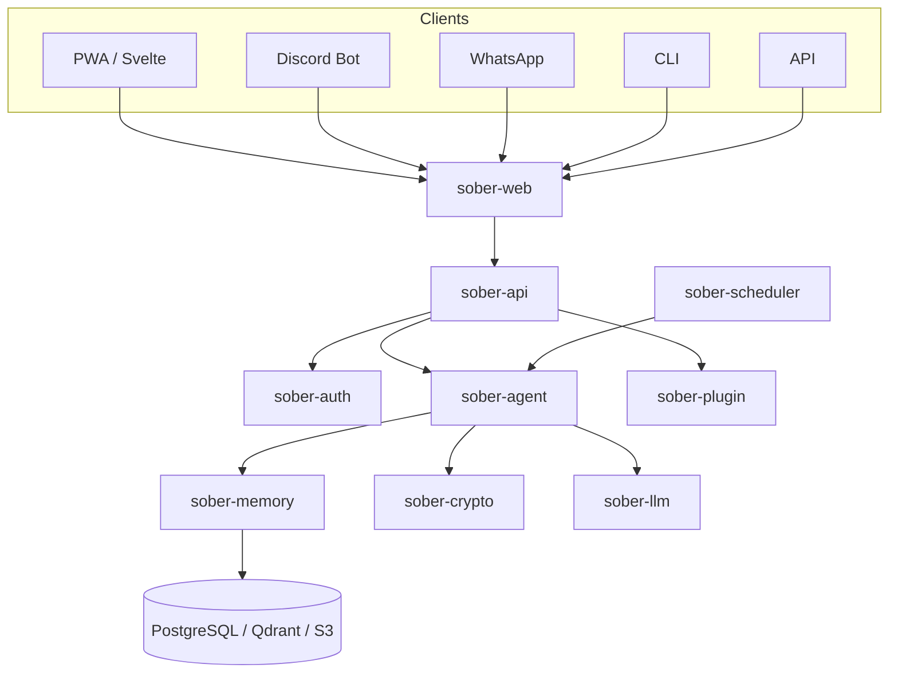
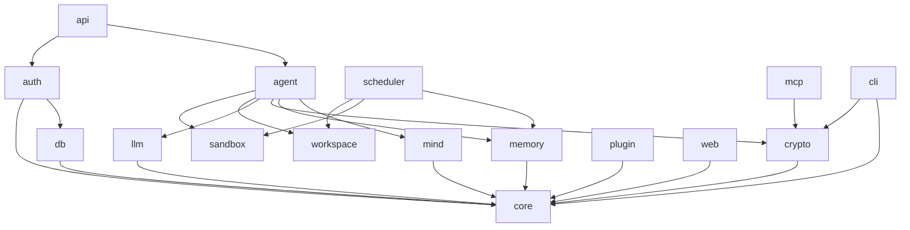
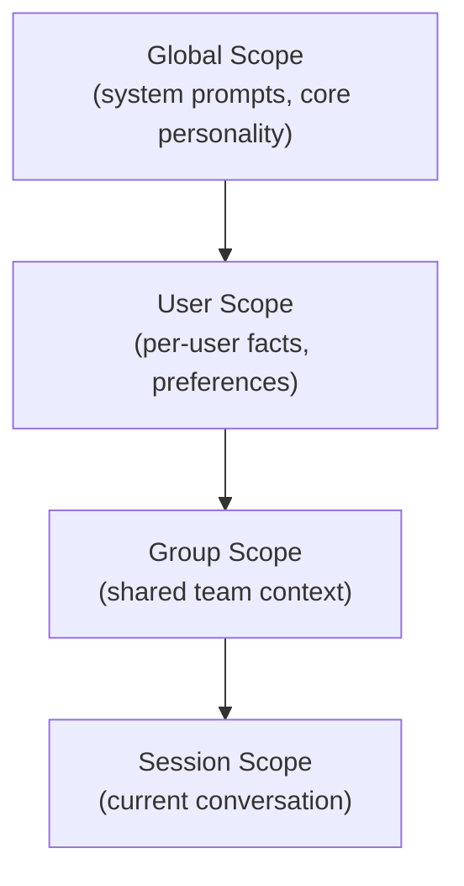

# Documentation Implementation Plan

> **For agentic workers:** REQUIRED SUB-SKILL: Use superpowers:subagent-driven-development (recommended) or superpowers:executing-plans to implement this plan task-by-task. Steps use checkbox (`- [ ]`) syntax for tracking.

**Goal:** Add README.md and a full mdBook documentation site with GitHub Pages deployment.

**Architecture:** Two-layer docs — concise README as GitHub landing page, mdBook site for depth. Content repurposed from ARCHITECTURE.md and CLAUDE.md where applicable, written fresh for user-facing guides. Mermaid diagrams throughout.

**Tech Stack:** mdBook, mdbook-mermaid, GitHub Actions, GitHub Pages

**Note:** This is docs-only work. Per CLAUDE.md: "Direct to main (no worktree): docs-only, config changes, non-Rust/Svelte changes." Commit directly to main.

---

### Task 1: Prerequisites & Scaffolding

**Files:**
- Create: `LICENSE`
- Create: `docs/book/book.toml`
- Create: `docs/book/src/SUMMARY.md`
- Modify: `.gitignore`
- Modify: `backend/Cargo.toml`
- Modify: `scripts/install.sh` (line 13: fix GITHUB_REPO)

- [ ] **Step 1: Create MIT LICENSE file**

```
MIT License

Copyright (c) 2025 Sõber Contributors

Permission is hereby granted, free of charge, to any person obtaining a copy
of this software and associated documentation files (the "Software"), to deal
in the Software without restriction, including without limitation the rights
to use, copy, modify, merge, publish, distribute, sublicense, and/or sell
copies of the Software, and to permit persons to whom the Software is
furnished to do so, subject to the following conditions:

The above copyright notice and this permission notice shall be included in all
copies or substantial portions of the Software.

THE SOFTWARE IS PROVIDED "AS IS", WITHOUT WARRANTY OF ANY KIND, EXPRESS OR
IMPLIED, INCLUDING BUT NOT LIMITED TO THE WARRANTIES OF MERCHANTABILITY,
FITNESS FOR A PARTICULAR PURPOSE AND NONINFRINGEMENT. IN NO EVENT SHALL THE
AUTHORS OR COPYRIGHT HOLDERS BE LIABLE FOR ANY CLAIM, DAMAGES OR OTHER
LIABILITY, WHETHER IN AN ACTION OF CONTRACT, TORT OR OTHERWISE, ARISING FROM,
OUT OF OR IN CONNECTION WITH THE SOFTWARE OR THE USE OR OTHER DEALINGS IN THE
SOFTWARE.
```

- [ ] **Step 2: Fix Cargo.toml repository URL**

In `backend/Cargo.toml`, change:
```toml
repository = "https://github.com/harrisiirak/s-ber"
```
to:
```toml
repository = "https://github.com/sober-io/sober"
```

- [ ] **Step 3: Fix install.sh GITHUB_REPO**

In `scripts/install.sh` line 13, change:
```bash
GITHUB_REPO="harrisiirak/s-ber"
```
to:
```bash
GITHUB_REPO="sober-io/sober"
```

- [ ] **Step 4: Add docs/book/build/ to .gitignore**

Append to `.gitignore`:
```
# mdBook build output
docs/book/build/
```

- [ ] **Step 5: Create docs/book/book.toml**

```toml
[book]
title = "Sõber Documentation"
authors = ["Sõber Contributors"]
language = "en"
multilingual = false
src = "src"

[build]
build-dir = "build"

[preprocessor.mermaid]
command = "mdbook-mermaid"

[output.html]
git-repository-url = "https://github.com/sober-io/sober"
edit-url-template = "https://github.com/sober-io/sober/edit/main/docs/book/{path}"
```

- [ ] **Step 6: Create directory structure**

Create all directories:
```
docs/book/src/getting-started/
docs/book/src/user-guide/
docs/book/src/plugins/
docs/book/src/architecture/
```

- [ ] **Step 7: Create docs/book/src/SUMMARY.md**

```markdown
# Summary

[Introduction](introduction.md)

# Getting Started

- [Prerequisites](getting-started/prerequisites.md)
- [Installation](getting-started/installation.md)
- [Configuration](getting-started/configuration.md)
- [First Run](getting-started/first-run.md)

# User Guide

- [CLI](user-guide/cli.md)
- [Workspaces](user-guide/workspaces.md)
- [Conversations](user-guide/conversations.md)
- [Memory](user-guide/memory.md)
- [MCP Servers](user-guide/mcp.md)
- [Built-in Tools](user-guide/tools.md)
- [Scheduling](user-guide/scheduling.md)
- [Frontend](user-guide/frontend.md)

# Plugins

- [Overview](plugins/overview.md)
- [Quick Start](plugins/quickstart.md)
- [Manifest](plugins/manifest.md)
- [Capabilities](plugins/capabilities.md)
- [Examples](plugins/examples.md)

# Architecture

- [Overview](architecture/overview.md)
- [Crate Map](architecture/crates.md)
- [Memory System](architecture/memory-system.md)
- [Security](architecture/security.md)
- [Agent Mind](architecture/agent-mind.md)
- [Event Delivery](architecture/event-delivery.md)

---

[Contributing](contributing.md)
```

- [ ] **Step 8: Verify mdBook builds**

Install mdbook + mdbook-mermaid if not already available:
```bash
cargo install mdbook mdbook-mermaid
```

Create placeholder files for each entry in SUMMARY.md (mdBook will error on missing files). Each placeholder should contain just the page title as `# Title`.

Run:
```bash
cd docs/book && mdbook-mermaid install && mdbook build
```
Expected: Build succeeds, output in `docs/book/build/`.

- [ ] **Step 9: Move plan to active/**

```bash
git mv docs/plans/pending/035-documentation docs/plans/active/035-documentation
```

- [ ] **Step 10: Commit**

```bash
git add LICENSE .gitignore backend/Cargo.toml scripts/install.sh docs/book/ docs/plans/
git commit -m "#035: add LICENSE, mdBook scaffolding, fix repo URLs"
```

---

### Task 2: README.md

**Files:**
- Create: `README.md`

**Reference:**
- `ARCHITECTURE.md` — system diagram to convert to Mermaid
- `justfile` — dev commands
- `scripts/install.sh` — install one-liner

- [ ] **Step 1: Write README.md**

Structure (~150-200 lines):

1. **Header** — `# Sõber` + tagline + badges row:
   - `[](https://github.com/sober-io/sober/actions/workflows/ci.yml)`
   - `[](LICENSE)`

2. **What is Sõber?** — 3-4 sentences from ARCHITECTURE.md vision section. Self-evolving AI agent system, multi-agent orchestration, plugin system, memory system.

3. **Features** — Bullet list:
   - Multi-agent orchestration with replica spawning
   - WASM plugin system (Extism) — sandboxed execution via wasmtime, capability-gated host functions
   - Process-level sandboxing (bwrap) with policy profiles and network filtering
   - Binary Context Format (BCF) for compact memory export/snapshots — header flags for future compression and encryption
   - Scoped memory with Qdrant vector search — hybrid dense + sparse (BM25) retrieval, context isolation across user/group/session boundaries
   - 17 built-in agent tools (web search, sandboxed shell, memory recall/remember, artifacts, secrets, snapshots, scheduling, plugin generation)
   - Multi-provider LLM support (OpenRouter, Ollama, OpenAI, local agents via ACP)
   - Prompt injection defense (input sanitization, canary tokens, output filtering, context firewall)
   - Cryptographic agent identity (ed25519 signing, AES-256-GCM envelope encryption)
   - Security-first design — session auth, context isolation, encrypted secrets, sandboxed execution
   - CLI admin tools (`sober` + `soberctl`)
   - SvelteKit PWA frontend
   - Autonomous scheduling (cron, interval, job persistence)
   - Self-evolution — autonomous plugin/skill installation, trait evolution, soul layer adaptation (all audited)
   - MCP server/client integration (sandboxed via sober-sandbox)

4. **Quick Start** — Docker Compose:
   ```bash
   git clone https://github.com/sober-io/sober.git
   cd sober
   cp .env.example .env  # Edit with your LLM API key
   docker compose up -d
   # Open http://localhost:8088
   ```

5. **Installation** — Three methods:
   - One-liner: `curl -fsSL https://raw.githubusercontent.com/sober-io/sober/main/scripts/install.sh | sudo bash`
   - Docker (link to docs)
   - From source (link to docs)

6. **Development** — Key justfile commands:
   ```bash
   just setup    # Configure git hooks
   just dev      # Start dev servers
   just test     # Run unit tests
   just check    # Lint + type check
   ```

7. **Architecture** — Simplified Mermaid flowchart showing: Clients → sober-web → sober-api → {sober-agent, sober-auth, sober-plugin} → {sober-memory, sober-crypto, sober-llm} → Storage. Link to full architecture docs.

8. **Documentation** — Link to `https://sober-io.github.io/sober/`

9. **License** — MIT, link to LICENSE file.

- [ ] **Step 2: Verify Mermaid renders on GitHub**

Review the README in GitHub's preview (or locally with a Markdown renderer). Mermaid diagrams should render natively on GitHub.

- [ ] **Step 3: Commit**

```bash
git add README.md
git commit -m "docs: add README with project overview, quick start, and architecture diagram"
```

---

### Task 3: Getting Started Section

**Files:**
- Create: `docs/book/src/introduction.md`
- Create: `docs/book/src/getting-started/prerequisites.md`
- Create: `docs/book/src/getting-started/installation.md`
- Create: `docs/book/src/getting-started/configuration.md`
- Create: `docs/book/src/getting-started/first-run.md`

**Reference:**
- `backend/crates/sober-core/src/config.rs` — AppConfig struct
- `.env.example` — env var names and defaults
- `scripts/install.sh` — flags and usage
- `docker-compose.yml` — compose setup

- [ ] **Step 1: Write introduction.md**

Expanded version of README's "What is Sõber?" section. Cover: vision (self-evolving agent), key concepts (agents, replicas, plugins, memory scopes), and what the docs cover. Highlight: security-first design (sandboxed execution, context isolation, zero-trust boundaries) and self-evolution capabilities (autonomous plugin/skill installation, trait evolution, soul layer adaptation). ~100 lines.

- [ ] **Step 2: Write prerequisites.md**

Required software per deployment method:
- **Binary install (install.sh):** Linux (x86_64/aarch64), systemd, curl/wget, PostgreSQL 17, Qdrant
- **Docker:** Docker Engine 24+, Docker Compose v2
- **From source:** Rust (latest stable), Node.js 24, pnpm, protobuf-compiler, Docker (for integration tests and sqlx)

- [ ] **Step 3: Write installation.md**

Three installation methods:

1. **install.sh (recommended for production)**
   - One-liner: `curl -fsSL https://raw.githubusercontent.com/sober-io/sober/main/scripts/install.sh | sudo bash`
   - What it does: downloads latest release from GitHub, creates `sober` system user, installs to `/opt/sober`, sets up systemd services, runs migrations
   - CLI flags table: `--user`, `--version`, `--yes`, `--uninstall`, `--database-url`, `--llm-base-url`, `--llm-api-key`, `--llm-model`, `--help`
   - Upgrade: re-run the same command (auto-detects existing install)
   - Uninstall: `curl ... | sudo bash -s -- --uninstall` (preserves data)

2. **Docker Compose**
   - Clone, copy `.env.example`, edit, `docker compose up -d`
   - Services started: PostgreSQL, Qdrant, SearXNG, sober-agent, sober-api, sober-scheduler, sober-web, auto-migration
   - Ports: 8088 (web UI), 3000 (API)

3. **From source**
   - Clone, install prerequisites, `cd backend && cargo build --release`, `cd frontend && pnpm install && pnpm build`
   - Binary locations, manual systemd setup reference

- [ ] **Step 4: Write configuration.md**

Complete environment variable reference table. Group by subsystem:

| Variable | Default | Description |
|----------|---------|-------------|
| `SOBER_ENV` | `development` | Environment mode |
| `DATABASE_URL` | — (required) | PostgreSQL connection string |
| `DATABASE_MAX_CONNECTIONS` | `10` | Connection pool size |
| `QDRANT_URL` | `http://localhost:6334` | Vector database endpoint |
| `QDRANT_API_KEY` | — | Qdrant auth (optional) |
| `HOST` | `0.0.0.0` | Server bind address |
| `PORT` | `3000` | Server bind port |
| `LLM_BASE_URL` | `https://openrouter.ai/api/v1` | LLM API endpoint |
| `LLM_API_KEY` | — | LLM provider API key |
| `LLM_MODEL` | `anthropic/claude-sonnet-4` | Model identifier |
| `LLM_MAX_TOKENS` | `4096` | Max completion tokens |
| `EMBEDDING_MODEL` | `text-embedding-3-small` | Embedding model |
| `EMBEDDING_DIM` | `1536` | Embedding vector dimensionality |
| `SESSION_SECRET` | — | Session signing key (required in prod) |
| `SESSION_TTL_SECONDS` | `2592000` | Session lifetime (30 days) |
| `SEARXNG_URL` | `http://localhost:8080` | SearXNG instance URL |
| `ADMIN_SOCKET_PATH` | `/run/sober/admin.sock` | Admin Unix socket |
| `SCHEDULER_TICK_INTERVAL_SECS` | `1` | Scheduler tick frequency |
| `SCHEDULER_AGENT_SOCKET_PATH` | `/run/sober/agent.sock` | Agent gRPC socket |
| `SCHEDULER_SOCKET_PATH` | `/run/sober/scheduler.sock` | Scheduler socket |
| `SCHEDULER_MAX_CONCURRENT_JOBS` | `10` | Max concurrent jobs |
| `MCP_REQUEST_TIMEOUT_SECS` | `30` | MCP request timeout |
| `MCP_MAX_CONSECUTIVE_FAILURES` | `3` | Failures before unhealthy |
| `MCP_IDLE_TIMEOUT_SECS` | `300` | MCP idle timeout |
| `MEMORY_DECAY_HALF_LIFE_DAYS` | `30` | Memory importance decay |
| `MEMORY_RETRIEVAL_BOOST` | `0.2` | Recent memory boost |
| `MEMORY_PRUNE_THRESHOLD` | `0.1` | Minimum importance |
| `MASTER_ENCRYPTION_KEY` | — | Hex 256-bit key (optional). Generate: `openssl rand -hex 32` |
| `RUST_LOG` | `info` | Log level filter |
| `OTEL_EXPORTER_OTLP_ENDPOINT` | — | OpenTelemetry collector endpoint (optional) |
| `PUBLIC_API_URL` | `http://localhost:3000` | Public API URL (used by frontend) |
| `ACP_AGENT_COMMAND` | — | Local coding agent binary (optional, e.g. "claude"). Not in `.env.example` — config.rs only |
| `ACP_AGENT_NAME` | — | Local agent display name. Not in `.env.example` |
| `ACP_AGENT_ARGS` | `acp` | Local agent CLI args. Not in `.env.example` |

Note: `.env.example` overrides some code defaults (e.g. `SCHEDULER_TICK_INTERVAL_SECS=60` vs code default of `1`). Document what `.env.example` ships with since that's what users see.

Note: `install.sh` writes a `/etc/sober/config.toml` but the application reads config exclusively from env vars (via `AppConfig`). The TOML file is a convenience reference only — document it as such, not as a config mechanism.

- [ ] **Step 5: Write first-run.md**

Walk through:
1. Open web UI (http://localhost:8088 for Docker, http://localhost:3000 for binary)
2. Create first user account (registration page)
3. Start a conversation
4. Basic agent interaction
5. Where to go next (link to user guide sections)

- [ ] **Step 6: Verify mdBook builds**

```bash
cd docs/book && mdbook build
```
Expected: Build succeeds with no missing file warnings.

- [ ] **Step 7: Commit**

```bash
git add docs/book/src/introduction.md docs/book/src/getting-started/
git commit -m "docs: add getting started section — prerequisites, installation, configuration, first run"
```

---

### Task 4: User Guide Section

**Files:**
- Create: `docs/book/src/user-guide/tools.md`
- Create: `docs/book/src/user-guide/cli.md`
- Create: `docs/book/src/user-guide/workspaces.md`
- Create: `docs/book/src/user-guide/conversations.md`
- Create: `docs/book/src/user-guide/memory.md`
- Create: `docs/book/src/user-guide/mcp.md`
- Create: `docs/book/src/user-guide/scheduling.md`
- Create: `docs/book/src/user-guide/frontend.md`

**Reference:**
- `backend/crates/sober-cli/src/` — CLI commands and subcommands
- `backend/crates/sober-workspace/src/` — workspace layout
- `backend/crates/sober-mcp/src/` — MCP implementation
- `backend/crates/sober-scheduler/src/` — scheduler
- `ARCHITECTURE.md` — memory scoping, event delivery
- `frontend/package.json` — frontend scripts

- [ ] **Step 1: Write tools.md**

Document all 17 built-in agent tools, grouped by category:

**Reference:** `backend/crates/sober-agent/src/tools/` — all tool implementations. Verify actual tool names by reading `tools/mod.rs` and `tools/bootstrap.rs`.

**Web & Search (static — built once at startup):**
- `web_search` — search the web via SearXNG
- `fetch_url` — fetch and extract URL content (text-based, 8000 char limit)

**Memory (static):**
- `recall` — active memory search with vector queries, optional chunk-type filtering (fact, conversation, preference, skill, code, soul)
- `remember` — explicit memory storage with caller-provided importance scoring and decay scheduling

**Scheduling (static):**
- `scheduler` — manage scheduled jobs (create, list, pause, resume, cancel)

**Shell (per-conversation):**
- `shell` — sandboxed shell command execution via bwrap, with command classification and risk-level detection

**Secrets (per-conversation):**
- `store_secret` — encrypt and store secrets (AES-256-GCM, DEK-wrapped via MEK)
- `read_secret` — decrypt and retrieve secrets (internal-only, not exposed via WebSocket)
- `list_secrets` — list secret metadata
- `delete_secret` — remove a secret

**Artifacts (per-conversation):**
- `create_artifact` — create workspace artifacts (inline or blob-backed)
- `list_artifacts` — list artifacts with optional kind/state filtering
- `read_artifact` — read artifact content by ID
- `delete_artifact` — archive (soft-delete) artifacts

**Snapshots (per-conversation):**
- `create_snapshot` — create tar snapshots of conversation workspace
- `list_snapshots` — list workspace snapshots
- `restore_snapshot` — restore from snapshot (with pre-restore safety snapshot)

**Plugins (per-conversation):**
- `generate_plugin` — generate WASM plugins or markdown skills via LLM

For each tool: name, description, parameters, example usage. Note which tools are static (shared across conversations) vs. per-conversation (rebuilt each turn).

- [ ] **Step 2: Write cli.md**

Two binaries:

**`sober`** — offline admin tool (no running services needed):
- `sober migrate run` — run database migrations
- `sober migrate status` — check migration status
- `sober keygen` — generate cryptographic keypairs
- Document each subcommand with usage examples

**`soberctl`** — runtime admin tool (connects via Unix socket):
- `soberctl status` — check service status
- `soberctl jobs list` — list scheduled jobs
- `soberctl agent` — agent management
- Document connection to admin socket

Source: run `cargo run -q --bin sober -- --help` and `cargo run -q --bin soberctl -- --help` to get actual subcommand lists.

- [ ] **Step 3: Write workspaces.md**

Cover:
- What workspaces are (isolated environments for agent work)
- Directory layout (`/opt/sober/data/workspaces/` or `~/.sober/workspaces/`)
- `.sober/` directory structure (soul.md, workspace config)
- Git integration (libgit2)
- Blob storage for artifacts

- [ ] **Step 4: Write conversations.md**

Cover:
- Creating and managing conversations
- Group conversations
- Conversation settings (model, temperature, etc.)
- WebSocket connection for real-time updates
- Message types and tool calls

- [ ] **Step 5: Write memory.md**

User-facing explanation with depth on BCF and vector retrieval:

- What the agent remembers and how
- **Memory scopes** (global → user → group → session) with Mermaid diagram
- **Binary Context Format (BCF)** — explain the compact binary container:
  - 28-byte header: magic `SÕBE`, version, flags, scope UUID, chunk count
  - Chunk table: 13 bytes per entry (offset, length, type discriminant)
  - 7 chunk types: Fact, Conversation, Embedding, Preference, Skill, Code, Soul
  - Header flags reserve bits for future zstd compression (bit 0) and AES-256-GCM encryption (bit 1) — neither is implemented yet, document as format capability
  - Used for memory export/snapshots, not live storage
- **Vector retrieval via Qdrant** — how live memory works:
  - Scoped collections: `user_{uuid}`, `system`
  - Hybrid search: dense vectors + sparse BM25 for keyword matching
  - Importance scoring: caller-provided values (0.0..=1.0), no per-type defaults — importance drives decay and pruning
  - Passive loading (preferences on every turn) vs. active recall (facts/skills on demand via `recall` tool)
- **Memory decay and pruning** — half-life decay, retrieval boost, prune threshold
- **Context loading priority** — recent messages first, then user-scope, then system-scope
- How to control what's remembered (explicit `remember` tool, importance scores)

- [ ] **Step 6: Write mcp.md**

Cover:
- What MCP is (Model Context Protocol)
- Adding MCP servers (stdio, SSE)
- MCP server lifecycle
- Configuration options (timeouts, failures)
- Example MCP server integrations

- [ ] **Step 7: Write scheduling.md**

Cover:
- Autonomous scheduling overview
- Job types: prompt (→ agent), internal (local), artifact (sandboxed)
- Cron syntax for recurring jobs
- Interval-based scheduling
- Job persistence and recovery
- Mermaid diagram of job routing

- [ ] **Step 8: Write frontend.md**

Cover:
- SvelteKit PWA overview
- Prerequisites: Node.js 24, pnpm
- Install dependencies: `cd frontend && pnpm install`
- Development: `pnpm dev` (port 5173)
- Production build: `pnpm build` (output to `frontend/build/`)
- How sober-web serves it (rust-embed or from disk, reverse proxy for API/WS)
- Type checking: `pnpm check`
- Testing: `pnpm test`
- Linting: `pnpm lint` / `pnpm format`

- [ ] **Step 9: Verify mdBook builds**

```bash
cd docs/book && mdbook build
```

- [ ] **Step 10: Commit**

```bash
git add docs/book/src/user-guide/
git commit -m "docs: add user guide — tools, CLI, workspaces, conversations, memory, MCP, scheduling, frontend"
```

---

### Task 5: Plugin Development Section

**Files:**
- Create: `docs/book/src/plugins/overview.md`
- Create: `docs/book/src/plugins/quickstart.md`
- Create: `docs/book/src/plugins/manifest.md`
- Create: `docs/book/src/plugins/capabilities.md`
- Create: `docs/book/src/plugins/examples.md`

**Reference:**
- `backend/crates/sober-plugin/src/manifest.rs` — manifest parsing
- `backend/crates/sober-plugin/src/host/` — host function implementations
- `backend/crates/sober-plugin/src/wasm/` — WASM runtime
- `ARCHITECTURE.md` — plugin lifecycle, audit pipeline

- [ ] **Step 1: Write overview.md**

Cover:
- What plugins are (WASM modules via Extism, executed in wasmtime sandbox)
- Plugin lifecycle with Mermaid diagram: DISCOVER → AUDIT → SANDBOX_TEST → INSTALL → MONITOR → UPDATE/REMOVE
- Security model: capability-gated host functions, WASM isolation, audit pipeline (static analysis → capability declaration → sandbox test → behavioral analysis)
- Plugin vs skill vs tool distinction

- [ ] **Step 2: Write quickstart.md**

Tutorial: build a minimal plugin:
1. Create Rust project: `cargo new --lib my-plugin`
2. Add Extism PDK dependency
3. Write a simple `#[plugin_fn]` tool function
4. Create `plugin.toml` manifest
5. Build: `cargo build --target wasm32-wasip1 --release`
6. Install via API or CLI

- [ ] **Step 3: Write manifest.md**

Full `plugin.toml` reference:
- `[plugin]` section: name, version, description
- `[[tools]]` array: name, description, parameters
- `[capabilities]` section: all 13 capability keys with types and examples
- `[[metrics]]` array: Prometheus-style metric declarations

- [ ] **Step 4: Write capabilities.md**

Document each host function:

| Function | Capability | Description |
|----------|-----------|-------------|
| `host_log` | (always available) | Structured logging |
| `host_kv_get/set/list/delete` | `key_value` | Plugin-scoped KV storage |
| `host_http_request` | `network` | Outbound HTTP (domain-restricted) |
| `host_emit_metric` | `metrics` | Prometheus metrics |
| `host_fs_read` | `filesystem` | Sandboxed file read |
| `host_fs_write` | `filesystem` | Sandboxed file write |
| `host_read_secret` | `secret_read` | Secret lookup |
| `host_call_tool` | `tool_call` | Tool invocation |
| `host_memory_query` | `memory_read` | Vector memory search |
| `host_memory_write` | `memory_write` | Vector memory write |
| `host_conversation_read` | `conversation_read` | Conversation history |
| `host_schedule` | `schedule` | Job scheduling |
| `host_llm_complete` | `llm_call` | LLM completion |

For each: input/output JSON format, example usage, capability restrictions.

- [ ] **Step 5: Write examples.md**

2-3 example plugin snippets:
1. Simple greeting tool (no capabilities)
2. Web scraper (network capability)
3. Knowledge indexer (memory_read + memory_write)

- [ ] **Step 6: Verify mdBook builds**

```bash
cd docs/book && mdbook build
```

- [ ] **Step 7: Commit**

```bash
git add docs/book/src/plugins/
git commit -m "docs: add plugin development guide — overview, quickstart, manifest, capabilities, examples"
```

---

### Task 6: Architecture Section

**Files:**
- Create: `docs/book/src/architecture/overview.md`
- Create: `docs/book/src/architecture/crates.md`
- Create: `docs/book/src/architecture/memory-system.md`
- Create: `docs/book/src/architecture/security.md`
- Create: `docs/book/src/architecture/agent-mind.md`
- Create: `docs/book/src/architecture/event-delivery.md`

**Reference:**
- `ARCHITECTURE.md` — primary source for all architecture content
- `backend/crates/` — actual crate list (18 crates)

- [ ] **Step 1: Write overview.md**

Repurpose ARCHITECTURE.md "System Architecture" section. Convert ASCII diagram to Mermaid flowchart:



Document the four independent processes: sober-web, sober-api, sober-scheduler, sober-agent. Include ports and sockets table.

- [ ] **Step 2: Write crates.md**

Full crate map table — all 18 crates from `backend/crates/`:

| Crate | Responsibility |
|-------|---------------|
| `sober-core` | Shared types, error handling, config, domain primitives |
| `sober-db` | PostgreSQL access layer |
| `sober-auth` | Authentication (password/Argon2id), RBAC |
| `sober-memory` | Vector storage, BCF, scoped retrieval |
| `sober-agent` | Agent orchestration (gRPC server) |
| `sober-plugin` | Plugin registry, WASM host functions, audit |
| `sober-plugin-gen` | WASM plugin code generation |
| `sober-crypto` | Keypair management, envelope encryption |
| `sober-api` | HTTP/WebSocket gateway |
| `sober-web` | Reverse proxy + embedded frontend |
| `sober-cli` | CLI admin tools (sober + soberctl) |
| `sober-mind` | Agent identity, prompt assembly |
| `sober-scheduler` | Autonomous tick engine |
| `sober-mcp` | MCP server/client |
| `sober-sandbox` | Process sandboxing (bwrap) |
| `sober-llm` | Multi-provider LLM abstraction |
| `sober-workspace` | Workspace filesystem, git ops, blob storage |
| `sober-skill` | Skill registry and execution |

Mermaid dependency graph:


- [ ] **Step 3: Write memory-system.md**

Repurpose ARCHITECTURE.md sections: Binary Context Format, Scoped Memory, Vector Storage. Convert scope hierarchy to Mermaid:



This is a key page — highlight BCF and Qdrant as differentiators. Cover in depth:

**Binary Context Format (BCF)** — compact binary container for memory:
- Header layout (28 bytes): magic `0x53 0xD5 0x42 0x45` ("SÕBE"), version (u16), flags (u16, bit 0: encrypted, bit 1: compressed), scope UUID (16 bytes), chunk count (u32)
- Chunk table: 13 bytes per entry — offset (u64), length (u32), type discriminant (u8)
- 7 chunk types with Mermaid diagram: Fact(0), Conversation(1), Embedding(2), Preference(3), Skill(4), Code(5), Soul(6)
- Data section: concatenated chunk payloads after the table
- Header flags reserve bits for future zstd compression (bit 0) and AES-256-GCM encryption (bit 1) — not yet implemented
- Zero-copy reader (`BcfReader::parse`) for efficient deserialization
- Writer (`BcfWriter::new(scope_id)`) for building containers

**Vector Storage (Qdrant)** — live memory backend:
- Scoped collections: `user_{uuid_simple}`, `system`
- Hybrid indexing: dense vectors + sparse BM25
- Importance scoring: caller-provided values, exponential decay, retrieval boost
- Chunk metadata: `source_message_id` for traceability, `scope_id` for filtering

**Context Loading Pipeline** — how memory assembles for a turn:
- Priority order: recent messages → user-scope → system-scope
- Passive loading: only Preference chunks (shape personality every turn)
- Active recall: facts, skills, code, conversation via `recall` tool on demand
- Mermaid sequence diagram of the loading pipeline

**Pruning & Decay** — TTL-based pruning with importance scoring, configurable half-life

- [ ] **Step 4: Write security.md**

Repurpose ARCHITECTURE.md sections: Security Model, Authentication Stack, Authorization. This is a key page — highlight security as a differentiator. Cover:
- Prompt injection defense (5-layer model) with Mermaid sequence diagram: input sanitization → canary tokens → context firewall → output filtering → lockout
- Process sandboxing (sober-sandbox): bwrap profiles, network filtering, syscall auditing, policy profiles
- WASM plugin sandboxing: wasmtime isolation, capability-gated host functions, behavioral analysis
- Auth stack (current): password (Argon2id) with session tokens, role-based access control (RequireAdmin)
- Auth stack (planned — label clearly as "Planned"): OIDC, WebAuthn/Passkeys, FIDO2, HMAC API keys
- Role-based access control (RBAC)
- Permission scoping (knowledge, tools, agent, admin)
- Context isolation: memory scopes never leak across boundaries
- Cryptographic agent identity: ed25519 signing, AES-256-GCM envelope encryption
- MCP server sandboxing via sober-sandbox

- [ ] **Step 5: Write agent-mind.md**

Repurpose ARCHITECTURE.md "Agent Mind" section. Cover:
- Structured instruction directory (`instructions/*.md` with YAML frontmatter)
- Instruction categories: personality, guardrail, behavior, operation
- soul.md resolution chain with Mermaid diagram (base → user → workspace layering)
- Dynamic prompt assembly pipeline
- Visibility filtering by trigger (human, replica, admin, scheduler)
- Trait evolution: per-user/group soul layers evolve autonomously, base changes require high confidence or admin approval
- Self-modification scope table: memory/soul layers (autonomous) → plugins/skills (autonomous + sandbox + audit) → base soul.md (high confidence or admin) → core code (propose only)
- All evolution is audit-logged

- [ ] **Step 6: Write event-delivery.md**

Repurpose ARCHITECTURE.md "Event Delivery" section. Cover:
- SubscribeConversationUpdates subscription model
- HandleMessage unary RPC → async processing → broadcast
- ConversationUpdate event types
- Mermaid sequence diagram: User → WebSocket → API → HandleMessage → Agent → broadcast → SubscribeConversationUpdates → API → WebSocket → User
- Scheduler job routing: prompt → agent, internal → local executor, artifact → sandbox

- [ ] **Step 7: Verify mdBook builds**

```bash
cd docs/book && mdbook build
```

- [ ] **Step 8: Commit**

```bash
git add docs/book/src/architecture/
git commit -m "docs: add architecture section — overview, crates, memory, security, agent mind, events"
```

---

### Task 7: Contributing Page

**Files:**
- Create: `docs/book/src/contributing.md`

**Reference:**
- `CLAUDE.md` — dev rules (rewrite for external audience)
- `justfile` — available commands
- `docs/rust-patterns.md` — link to
- `docs/svelte-patterns.md` — link to

- [ ] **Step 1: Write contributing.md**

Sections:
1. **Development Setup** — clone, `just setup`, prerequisites, `.env` setup
2. **Project Structure** — repo layout overview
3. **Building** — backend (`cargo build`), frontend (`pnpm build`), full stack (Docker)
4. **Testing** — unit tests (`just test`), integration tests (`just test-integration`, requires Docker), per-crate testing
5. **Code Style** — Rust (`cargo fmt` + clippy), Svelte (prettier + eslint), link to `docs/rust-patterns.md` and `docs/svelte-patterns.md`
6. **Git Workflow** — branch prefixes (`feat/`, `fix/`, `refactor/`, `sec/`, `chore/`), commit convention, PR process (CI must pass, squash merge)
7. **Database Migrations** — sqlx-cli, creating/running migrations, offline mode
8. **Architecture** — link to architecture section of docs

Do NOT include: CLAUDE.md AI-specific instructions, worktree workflow details (that's for maintainers), version bump rules.

- [ ] **Step 2: Verify mdBook builds**

```bash
cd docs/book && mdbook build
```

- [ ] **Step 3: Commit**

```bash
git add docs/book/src/contributing.md
git commit -m "docs: add contributing guide"
```

---

### Task 8: CI Workflow & Justfile

**Files:**
- Create: `.github/workflows/docs.yml`
- Modify: `justfile`

- [ ] **Step 1: Create .github/workflows/docs.yml**

```yaml
name: Docs

on:
  push:
    branches: [main]
    paths:
      - 'docs/book/**'
      - 'README.md'
  workflow_dispatch:

permissions:
  pages: write
  id-token: write

concurrency:
  group: pages
  cancel-in-progress: true

jobs:
  deploy:
    name: Deploy Documentation
    runs-on: ubuntu-latest
    environment:
      name: github-pages
      url: ${{ steps.deployment.outputs.page_url }}
    steps:
      - uses: actions/checkout@v4

      - name: Install mdBook and mdbook-mermaid
        run: |
          mkdir -p "$HOME/.local/bin"
          curl -fsSL https://github.com/rust-lang/mdBook/releases/latest/download/mdbook-v0.4.44-x86_64-unknown-linux-gnu.tar.gz | tar -xz -C "$HOME/.local/bin"
          curl -fsSL https://github.com/badboy/mdbook-mermaid/releases/latest/download/mdbook-mermaid-v0.14.0-x86_64-unknown-linux-gnu.tar.gz | tar -xz -C "$HOME/.local/bin"
          echo "$HOME/.local/bin" >> "$GITHUB_PATH"

      - name: Build documentation
        working-directory: docs/book
        run: |
          mdbook-mermaid install
          mdbook build

      - name: Upload Pages artifact
        uses: actions/upload-pages-artifact@v3
        with:
          path: docs/book/build

      - name: Deploy to GitHub Pages
        id: deployment
        uses: actions/deploy-pages@v4
```

Note: check latest mdBook and mdbook-mermaid release versions at build time and pin to specific versions in the URLs above. The versions shown (v0.4.44, v0.14.0) are placeholders — verify and update.

- [ ] **Step 2: Add justfile commands**

Append to `justfile`:

```just
# Build documentation site
docs-build:
    cd docs/book && mdbook build

# Serve documentation locally with hot reload
docs-serve:
    cd docs/book && mdbook serve --open
```

- [ ] **Step 3: Verify workflow syntax**

```bash
gh workflow view docs.yml 2>/dev/null || echo "Will be validated on push"
```

Manually review YAML for syntax errors.

- [ ] **Step 4: Commit**

```bash
git add .github/workflows/docs.yml justfile
git commit -m "ci: add GitHub Pages docs deployment workflow, add docs justfile commands"
```

---

### Task 9: Final Verification & Cleanup

- [ ] **Step 1: Full mdBook build**

```bash
cd docs/book && mdbook build
```
Expected: Clean build, no warnings.

- [ ] **Step 2: Local preview**

```bash
cd docs/book && mdbook serve --open
```

Browse all pages, verify:
- All links work
- Mermaid diagrams render
- Table of contents navigation works
- Code blocks have syntax highlighting

- [ ] **Step 3: Verify README renders**

Check README.md Mermaid diagram renders in GitHub preview or local Markdown renderer.

- [ ] **Step 4: Move plan to done/**

```bash
git mv docs/plans/active/035-documentation docs/plans/done/035-documentation
git commit -m "#035: move plan to done"
```
